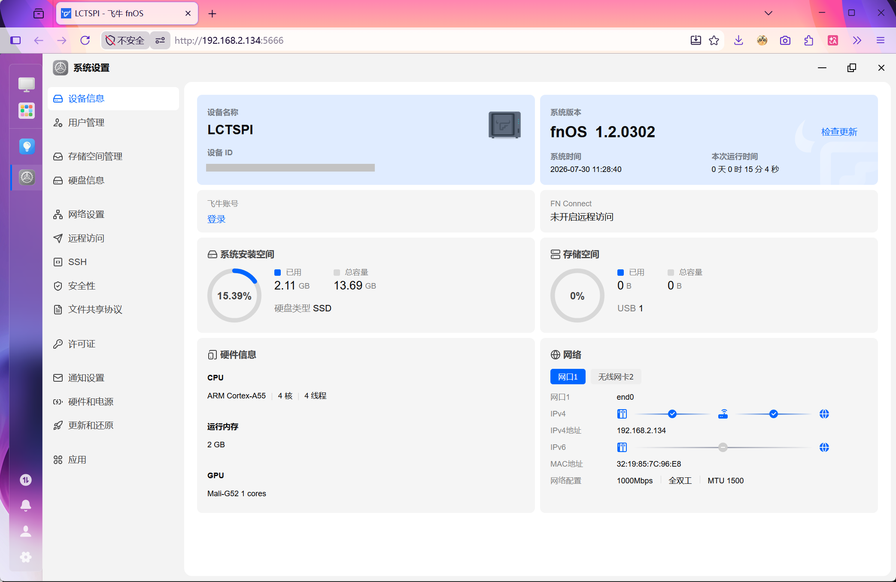
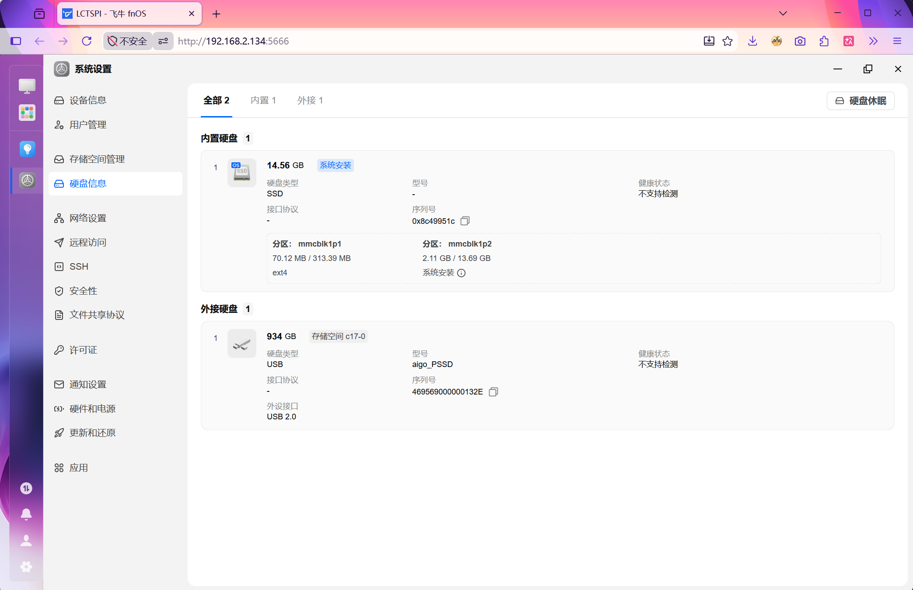
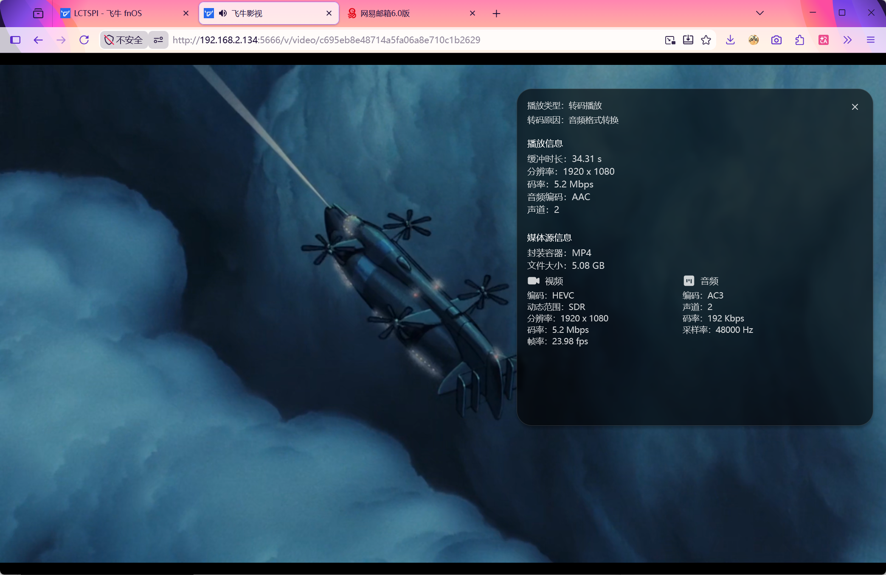
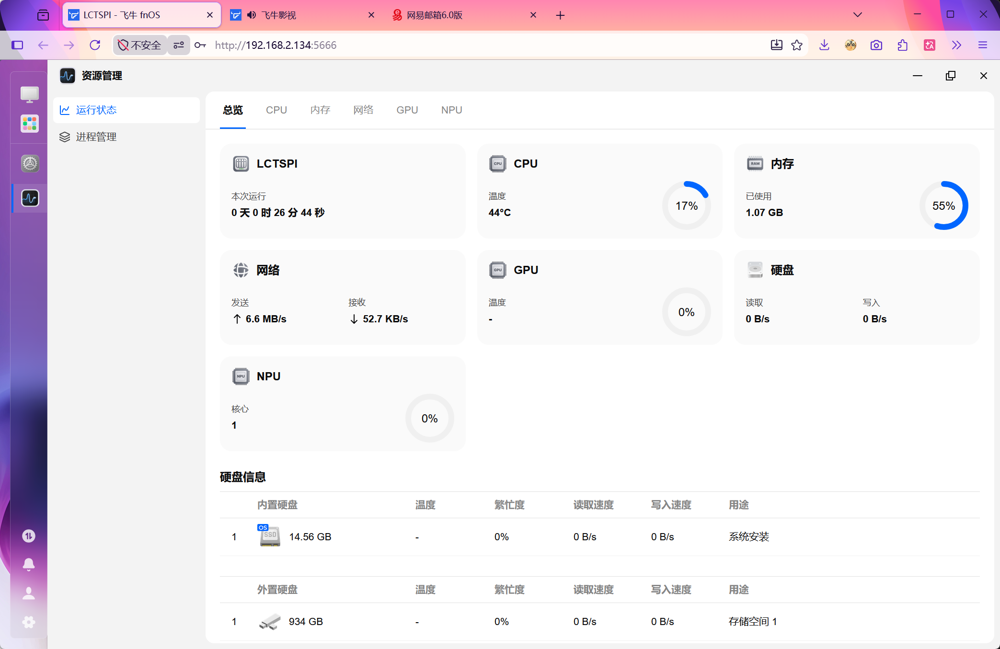

# 泰山派飞牛系统镜像

## 版本说明
* 基于官方 [萤火虫 Firefly ROC-RK3566-PC (Station M2)](https://fnnas.com/download-arm) 镜像重新打包
* 修改 `fnEnv.txt` 中的 `fdtfile` 为 `rockchip/rk3566-lckfb-tspi.dtb`
* 修改dts文件, 增加以太网卡, GPU, NPU，MPP(硬件解码)支持
* 增加`AP6212`的 firmware以支持WiFi网卡:
  * Link `lib/firmware/brcm/brcmfmac43430-sdio.lckfb,tspi-rk3566.bin` to `lib/firmware/brcm/brcmfmac43430-sdio.bin`
  * Add `lib/firmware/brcm/brcmfmac43430-sdio.txt`
* 设置默认密码为 root/root
  * 官方镜像默认禁用root账户, 在第一次启动时, 如果没有网络(比如有线都无法使用的时候), 没办法进入系统(WiFi需要进入系统之后手动扫描连接)

* [rk3566-lckfb-tspi.dts](https://github.com/WHJWNAVY/fnnas-linux-6.18.y/blob/main/arch/arm64/boot/dts/rockchip/rk3566-lckfb-tspi.dts)

## 烧录方法
* [Rockchip 瑞芯微系列 eMMC USB 线刷教程](https://help.fnnas.com/articles/v1/contact/arm-rk-usb)

## 系统截图







## 参考链接
* [ophub/fnnas](https://github.com/ophub/fnnas)
* [Rockchip 瑞芯微系列 eMMC USB 线刷教程](https://help.fnnas.com/articles/v1/contact/arm-rk-usb)
* [ARM飞牛社区版汇总[ophub][6.18已更新]](https://www.wifilu.com/4428.html)
* [替换飞牛ARM版本镜像dtb启动自己的ARM设备](https://club.fnnas.com/forum.php?mod=viewthread&tid=49495&highlight=)
* [秒赤！立创·泰山派安装飞牛 fnOS](https://blog.sixhz.com/archives/50/)
* [泰山派安装飞牛OS](https://www.bilibili.com/video/BV1G9ZLByEeJ/)
* [泰山派安装飞牛OS (官方镜像)](https://www.bilibili.com/video/BV1VEQqB4E6f/)
* [ARM版飞牛系统启用GPU加速转码方法，理论上适用于所有RK356X/3588设备](https://www.right.com.cn/forum/thread-8462138-1-1.html)
* [rk35xx启用GPU加速解码，这算是启用了吗？](https://github.com/ophub/fnnas/issues/213)
* [RK3566的GPU和NPU使用率一直是0%](https://club.fnnas.com/forum.php?mod=viewthread&tid=68671)
* [HWA Tutorial On Rockchip VPU](https://jellyfin.org/docs/general/post-install/transcoding/hardware-acceleration/rockchip/)

## DEBUG
### bootlog
```
DDR 03ea844c5d typ 24/09/03-10:42:57,fwver: v1.23
ln
wdqs_if: 0x1010100
LP4/4x derate en, other dram:1x trefi
ddrconfig:0
MID:0x1
LPDDR4, 324MHz
BW=32 Col=10 Bk=8 CS0 Row=16 CS=1 Die BW=16 Size=2048MB
tdqss_lf: cs0 dqs0: -48ps, dqs1: -96ps, dqs2: -120ps, dqs3: -168ps,
tdqss_hf: cs0 dqs0: -48ps, dqs1: -96ps, dqs2: -120ps, dqs3: -168ps,

change to: 324MHz
PHY drv:clk:38,ca:38,DQ:30,odt:0
vrefinner:41%, vrefout:41%
dram drv:40,odt:0
clk skew:0x64

change to: 528MHz
PHY drv:clk:38,ca:38,DQ:30,odt:0
vrefinner:41%, vrefout:41%
dram drv:40,odt:0
clk skew:0x58

change to: 780MHz
PHY drv:clk:38,ca:38,DQ:30,odt:60
vrefinner:16%, vrefout:41%
dram drv:40,odt:0
clk skew:0x58
rx vref: 18.4%
tx vref: 38.0%

change to: 1056MHz(final freq)
PHY drv:clk:38,ca:38,DQ:30,odt:60
vrefinner:16%, vrefout:29%
dram drv:40,odt:80
vref_ca:00000068
clk skew:0x42
rx vref: 17.4%
tx vref: 30.0%
cs 0:
rdtrn RS:
DQS0:0x34, DQS1:0x34, DQS2:0x35, DQS3:0x32,
min  : 0x5  0x5  0x5  0x3  0x4  0x2  0x4  0x4 , 0x3  0x4  0x6  0x5  0x2  0x4  0x6  0x3 ,
       0x5  0x4  0x6  0x4  0x4  0x2  0x4  0x6 , 0x2  0x3  0x4  0x2  0x3  0x1  0x3  0x4 ,
mid  :0x21 0x21 0x21 0x1f 0x21 0x1e 0x20 0x20 ,0x1e 0x1e 0x20 0x1f 0x1d 0x20 0x21 0x1e ,
      0x22 0x21 0x22 0x20 0x20 0x20 0x21 0x22 ,0x1d 0x1d 0x1f 0x1d 0x1d 0x1c 0x20 0x1e ,
max  :0x3e 0x3d 0x3d 0x3b 0x3e 0x3a 0x3d 0x3d ,0x3a 0x39 0x3a 0x3a 0x39 0x3c 0x3d 0x3a ,
      0x3f 0x3e 0x3e 0x3d 0x3d 0x3e 0x3e 0x3f ,0x38 0x37 0x3a 0x38 0x37 0x37 0x3d 0x39 ,
range:0x39 0x38 0x38 0x38 0x3a 0x38 0x39 0x39 ,0x37 0x35 0x34 0x35 0x37 0x38 0x37 0x37 ,
      0x3a 0x3a 0x38 0x39 0x39 0x3c 0x3a 0x39 ,0x36 0x34 0x36 0x36 0x34 0x36 0x3a 0x35 ,
wrtrn RS:
DQS0:0x3c, DQS1:0x36, DQS2:0x32, DQS3:0x2c,
min  :0x55 0x55 0x56 0x54 0x54 0x53 0x54 0x55 0x55 ,0x50 0x52 0x53 0x51 0x51 0x52 0x52 0x51 0x4f ,
      0x4b 0x4b 0x4c 0x4b 0x4a 0x4a 0x4b 0x4d 0x4b ,0x45 0x46 0x47 0x45 0x45 0x45 0x46 0x48 0x44 ,
mid  :0x70 0x71 0x71 0x6f 0x70 0x6f 0x70 0x71 0x70 ,0x69 0x6a 0x6b 0x6a 0x6a 0x6c 0x6c 0x6b 0x69 ,
      0x68 0x67 0x68 0x68 0x66 0x65 0x66 0x68 0x66 ,0x5e 0x5e 0x60 0x5e 0x5f 0x5f 0x62 0x61 0x5e ,
max  :0x8c 0x8d 0x8d 0x8b 0x8c 0x8b 0x8c 0x8d 0x8c ,0x83 0x83 0x83 0x83 0x84 0x86 0x87 0x85 0x84 ,
      0x85 0x84 0x84 0x85 0x83 0x80 0x82 0x83 0x82 ,0x78 0x77 0x7a 0x78 0x7a 0x79 0x7f 0x7b 0x79 ,
range:0x37 0x38 0x37 0x37 0x38 0x38 0x38 0x38 0x37 ,0x33 0x31 0x30 0x32 0x33 0x34 0x35 0x34 0x35 ,
      0x3a 0x39 0x38 0x3a 0x39 0x36 0x37 0x36 0x37 ,0x33 0x31 0x33 0x33 0x35 0x34 0x39 0x33 0x35 ,
CBT RS:
cs:0 min  :0x49 0x40 0x47 0x3a 0x44 0x3d 0x41 ,0x48 0x3c 0x45 0x3b 0x44 0x36 0x43 ,
cs:0 mid  :0x84 0x83 0x81 0x7d 0x7f 0x7e 0x6b ,0x81 0x7f 0x80 0x7d 0x7e 0x7a 0x6c ,
cs:0 max  :0xbf 0xc7 0xbc 0xc1 0xba 0xbf 0x96 ,0xba 0xc2 0xbc 0xc0 0xb8 0xbe 0x96 ,
cs:0 range:0x76 0x87 0x75 0x87 0x76 0x82 0x55 ,0x72 0x86 0x77 0x85 0x74 0x88 0x53 ,
out

U-Boot SPL 2026.07-TRIM-c225-00043-g916119cbaf0e (Jul 13 2026 - 06:20:21 +0000)
Trying to boot from MMC1
## Checking hash(es) for config config-1 ... OK
## Checking hash(es) for Image atf-1 ... sha256+ OK
## Checking hash(es) for Image u-boot ... sha256+ OK
## Checking hash(es) for Image fdt-1 ... sha256+ OK
## Checking hash(es) for Image atf-2 ... sha256+ OK
## Checking hash(es) for Image atf-3 ... sha256+ OK
## Checking hash(es) for Image atf-4 ... sha256+ OK
## Checking hash(es) for Image atf-5 ... sha256+ OK
## Checking hash(es) for Image atf-6 ... sha256+ OK
INFO:    Preloader serial: 2
NOTICE:  BL31: v2.3():v2.3-896-g70d3deb59:huan.he, fwver: v1.45
NOTICE:  BL31: Built : 16:38:07, Mar  4 2025
INFO:    GICv3 without legacy support detected.
INFO:    ARM GICv3 driver initialized in EL3
INFO:    pmu v1 is valid 220114
INFO:    l3 cache partition cfg-0
INFO:    dfs DDR fsp_param[0].freq_mhz= 1056MHz
INFO:    dfs DDR fsp_param[1].freq_mhz= 324MHz
INFO:    dfs DDR fsp_param[2].freq_mhz= 528MHz
INFO:    dfs DDR fsp_param[3].freq_mhz= 780MHz
INFO:    Using opteed sec cpu_context!
INFO:    boot cpu mask: 0
INFO:    BL31: Initializing runtime services
WARNING: No OPTEE provided by BL2 boot loader, Booting device without OPTEE initialization. SMC`s destined for OPTEE will return SMC_UNK
ERROR:   Error initializing runtime service opteed_fast
INFO:    BL31: Preparing for EL3 exit to normal world
INFO:    Entry point address = 0x800000
INFO:    SPSR = 0x3c9


U-Boot 2026.07-TRIM-c225-00043-g916119cbaf0e (Jul 13 2026 - 06:20:21 +0000)

Model: Firefly Station M2
SoC:   RK3566
DRAM:  2 GiB
PMIC:  RK809 (on=0x40, off=0x00)
Core:  619 devices, 28 uclasses, devicetree: separate
MMC:   mmc@fe2b0000: 1, mmc@fe2c0000: 2, mmc@fe310000: 0
Loading Environment from nowhere... OK
In:    serial@fe660000
Out:   serial@fe660000
Err:   serial@fe660000
Model: Firefly Station M2
SoC:   RK3566
Net:   eth0: ethernet@fe010000
Hit any key to stop autoboot: 0
Scanning for bootflows in all bootdevs
Seq  Method       State   Uclass    Part  Name                      Filename
---  -----------  ------  --------  ----  ------------------------  ----------------
Scanning global bootmeth 'efi_mgr':
Card did not respond to voltage select! : -110
Card did not respond to voltage select! : -110
Cannot persist EFI variables without system partition
  0  efi_mgr      ready   (none)       0  <NULL>
** Booting bootflow '<NULL>' with efi_mgr
Loading Boot0000 'mmc 0' failed
EFI boot manager: Cannot load any image
Boot failed (err=-14)
USB XHCI 1.10
USB EHCI 1.00
USB OHCI 1.0
ERROR:  USB-error: DEVICENOTRESPONDING: Device did not respond to token (IN) or did
not provide a handshake (OUT) (5)
ERROR: USB-error: DEVICENOTRESPONDING: Device did not respond to token (IN) or did
not provide a handshake (OUT) (5)
ERROR:  USB-error: DEVICENOTRESPONDING: Device did not respond to token (IN) or did
not provide a handshake (OUT) (5)
ERROR: USB-error: DEVICENOTRESPONDING: Device did not respond to token (IN) or did
not provide a handshake (OUT) (5)
ERROR:  USB-error: DEVICENOTRESPONDING: Device did not respond to token (IN) or did
not provide a handshake (OUT) (5)
ERROR: USB-error: DEVICENOTRESPONDING: Device did not respond to token (IN) or did
not provide a handshake (OUT) (5)
unable to get device descriptor (error=-1)
Bus usb@fd000000: 2 USB Device(s) found
Bus usb@fd800000: 1 USB Device(s) found
Bus usb@fd840000: 1 USB Device(s) found
Scanning bootdev 'mmc@fe2b0000.bootdev':
Card did not respond to voltage select! : -110
Card did not respond to voltage select! : -110
Card did not respond to voltage select! : -110
Card did not respond to voltage select! : -110
Scanning bootdev 'mmc@fe310000.bootdev':
  1  script       ready   mmc          1  mmc@fe310000.bootdev.part /boot.scr
** Booting bootflow 'mmc@fe310000.bootdev.part_1' with script
Boot script loaded from mmc 0:1
135 bytes read in 6 ms (21.5 KiB/s)
39778816 bytes read in 853 ms (44.5 MiB/s)
131849 bytes read in 38 ms (3.3 MiB/s)
Working FDT set to 12000000
## Flattened Device Tree blob at 12000000
   Booting using the fdt blob at 0x12000000
Working FDT set to 12000000
   Loading Device Tree to 000000007ce24000, end 000000007ceacfff ... OK
Working FDT set to 7ce24000

Starting kernel ...

[  OK  ] Started plymouth-start.ser…e - Show Plymouth Boot Screen.
[  OK  ] Started systemd-ask-passwo…uests to Plymouth Directory Watch.
[  OK  ] Reached target cryptsetup.…get - Local Encrypted Volumes.
[  OK  ] Found device dev-ttyS2.device - /dev/ttyS2.
[  OK  ] Finished systemd-random-se…rvice - Load/Save Random Seed.
[  OK  ] Finished lvm2-monitor.serv…sing dmeventd or progress polling.
[  OK  ] Reached target local-fs-pr…reparation for Local File Systems.
         Mounting tmp.mount - /tmp...
[  OK  ] Reached target machines.target - Containers.
[  OK  ] Mounted tmp.mount - /tmp.
[  OK  ] Found device dev-disk-by\x…b0b78-d6fd-4f9b-be9c-2b8ff3e821e1.
         Starting systemd-fsck@dev-…b78-d6fd-4f9b-be9c-2b8ff3e821e1...
[  OK  ] Started systemd-fsckd.serv…tem Check Daemon to report status.
fsckd-cancel-msg:Press Ctrl+C to cancel all filesystem checks in progress
[  OK  ] Reached target usb-gadget.…m - Hardware activated USB gadget.
Checking in progress on 0 disks (100.0% complete)
[  OK  ] Finished systemd-fsck@dev-…b0b78-d6fd-4f9b-be9c-2b8ff3e821e1.
         Mounting boot.mount - /boot...
[  OK  ] Mounted boot.mount - /boot.
[  OK  ] Listening on systemd-rfkil…l Switch Status /dev/rfkill Watch.
         Starting systemd-rfkill.se…Load/Save RF Kill Switch Status...
[  OK  ] Reached target bluetooth.target - Bluetooth Support.
[  OK  ] Reached target sound.target - Sound Card.
[  OK  ] Started systemd-rfkill.ser…- Load/Save RF Kill Switch Status.
[  OK  ] Finished systemd-udev-sett…To Complete Device Initialization.
[  OK  ] Reached target zfs-import.…rget - ZFS pool import target.
         Starting zfs-mount.service - Mount ZFS filesystems...
         Starting zfs-volume-wait.s…ZFS Volume (zvol) links in /dev...
[  OK  ] Finished zfs-mount.service - Mount ZFS filesystems.
[  OK  ] Reached target local-fs.target - Local File Systems.
         Starting apparmor.service - Load AppArmor profiles...
         Starting console-setup.ser…m - Set console font and keymap...
         Starting dpdk.service - DPDK runtime environment...
         Starting led-set.service - LED Setting Service...
         Starting plymouth-read-wri…mouth To Write Out Runtime Data...
         Starting pwm-fancontrol.se…e - PWM Fan Setting Service...
         Starting set_gpio-init.ser…m - GPIO Initialization Service...
         Starting systemd-binfmt.se…et Up Additional Binary Formats...
         Starting systemd-tmpfiles-…te System Files and Directories...
[  OK  ] Finished zfs-volume-wait.s…r ZFS Volume (zvol) links in /dev.
[  OK  ] Finished console-setup.ser…[0m - Set console font and keymap.
[  OK  ] Finished plymouth-read-wri…lymouth To Write Out Runtime Data.
[FAILED] Failed to start led-set.service - LED Setting Service.
See 'systemctl status led-set.service' for details.
[  OK  ] Finished pwm-fancontrol.se…ice - PWM Fan Setting Service.
[FAILED] Failed to start set_gpio-i…[0m - GPIO Initialization Service.
See 'systemctl status set_gpio-init.service' for details.
[  OK  ] Reached target zfs-volumes…arget - ZFS volumes are ready.
         Mounting proc-sys-fs-binfm…utable File Formats File System...
[  OK  ] Mounted proc-sys-fs-binfmt…ecutable File Formats File System.
[  OK  ] Finished systemd-binfmt.se… Set Up Additional Binary Formats.
[  OK  ] Finished apparmor.service - Load AppArmor profiles.
[  OK  ] Finished systemd-tmpfiles-…eate System Files and Directories.
         Mounting run-rpc_pipefs.mount - RPC Pipe File System...
         Starting rpcbind.service - RPC bind portmap service...
         Starting systemd-timesyncd… - Network Time Synchronization...
         Starting systemd-update-ut…rd System Boot/Shutdown in UTMP...
[  OK  ] Started rpcbind.service - RPC bind portmap service.
[  OK  ] Reached target rpcbind.target - RPC Port Mapper.
[  OK  ] Finished dpdk.service - DPDK runtime environment.
[  OK  ] Mounted run-rpc_pipefs.mount - RPC Pipe File System.
[  OK  ] Reached target rpc_pipefs.target.
         Starting nfs-blkmap.servic…NFS block layout mapping daemon...
[  OK  ] Reached target nfs-client.target - NFS client services.
[  OK  ] Reached target remote-fs-p…eparation for Remote File Systems.
[  OK  ] Reached target remote-fs.target - Remote File Systems.
[  OK  ] Started nfs-blkmap.service… pNFS block layout mapping daemon.
[  OK  ] Finished systemd-update-ut…cord System Boot/Shutdown in UTMP.
[  OK  ] Started systemd-timesyncd.…0m - Network Time Synchronization.
[  OK  ] Reached target sysinit.target - System Initialization.
[  OK  ] Started nut-driver-enumerator.path.
[  OK  ] Started systemd-tmpfiles-c… Cleanup of Temporary Directories.
[  OK  ] Reached target paths.target - Path Units.
[  OK  ] Reached target time-set.target - System Time Set.
[  OK  ] Started apt-daily.timer - Daily apt download activities.
[  OK  ] Started apt-daily-upgrade.… apt upgrade and clean activities.
[  OK  ] Started dpkg-db-backup.tim… Daily dpkg database backup timer.
[  OK  ] Started e2scrub_all.timer▒▒etadata Check for All Filesystems.
[  OK  ] Started exim4-base.timer - Daily exim4-base housekeeping.
[  OK  ] Started fstrim.timer - Discard unused blocks once a week.
[  OK  ] Started logrotate.timer - Daily rotation of log files.
[  OK  ] Started man-db.timer - Daily man-db regeneration.
[  OK  ] Started sysstat-collect.ti… accounting tool every 10 minutes.
[  OK  ] Started sysstat-summary.ti…of yesterday's process accounting.
[  OK  ] Reached target timers.target - Timer Units.
[  OK  ] Listening on avahi-daemon.…NS/DNS-SD Stack Activation Socket.
[  OK  ] Listening on dbus.socket▒▒- D-Bus System Message Bus Socket.
         Starting docker.socket - Docker Socket for the API...
[  OK  ] Listening on libvirtd.socket - Libvirt local socket.
[  OK  ] Listening on libvirtd-admi…socket - Libvirt admin socket.
[  OK  ] Listening on libvirtd-ro.s… - Libvirt local read-only socket.
[  OK  ] Listening on uuidd.socket▒▒m - UUID daemon activation socket.
[  OK  ] Listening on virtlockd.soc…rtual machine lock manager socket.
[  OK  ] Listening on virtlockd-adm…machine lock manager admin socket.
[  OK  ] Listening on virtlogd.sock…irtual machine log manager socket.
[  OK  ] Listening on virtlogd-admi…irtual machine log manager socket.
[  OK  ] Listening on docker.socket - Docker Socket for the API.
[  OK  ] Reached target sockets.target - Socket Units.
[  OK  ] Reached target basic.target - Basic System.
         Starting avahi-daemon.serv…e - Avahi mDNS/DNS-SD Stack...
[  OK  ] Started cron.service -…kground program processing daemon.
         Starting dbus.service - D-Bus System Message Bus...
         Starting e2scrub_reap.serv…e ext4 Metadata Check Snapshots...
         Starting nut-driver-enumer…ces into systemd unit instances...
         Starting polkit.service - Authorization Manager...
         Starting rsyslog.service - System Logging Service...
         Starting show_startup_info… trim show startup info service...
         Starting smartmontools.ser…rting Technology (SMART) Daemon...
         Starting sysstat.service - Resets System Activity Logs...
         Starting system_setmac.ser…able MAC addresses from MMC CID...
         Starting systemd-logind.se…ice - User Login Management...
         Starting systemd-machined.… Container Registration Service...
         Starting trim_init.service - trim init service...
[  OK  ] Started wsdd2.service …MNR Discovery/Name Service Daemon.
[  OK  ] Started zfs-zed.service - ZFS Event Daemon (zed).
         Starting zramswap.service - Linux zramswap setup...
[  OK  ] Finished e2scrub_reap.serv…ine ext4 Metadata Check Snapshots.
[  OK  ] Finished sysstat.service - Resets System Activity Logs.
[  OK  ] Finished system_setmac.ser…stable MAC addresses from MMC CID.
[  OK  ] Reached target network-pre…get - Preparation for Network.
         Starting ovsdb-server.serv…0m - Open vSwitch Database Unit...
[  OK  ] Started rsyslog.service - System Logging Service.
[FAILED] Failed to start smartmonto…porting Technology (SMART) Daemon.
See 'systemctl status smartmontools.service' for details.
[  OK  ] Started dbus.service - D-Bus System Message Bus.
[  OK  ] Finished zramswap.service - Linux zramswap setup.
         Starting NetworkManager.service - Network Manager...
         Starting wpa_supplicant.service - WPA supplicant...
[  OK  ] Started systemd-machined.s…nd Container Registration Service.
[  OK  ] Started systemd-logind.service - User Login Management.
[  OK  ] Started avahi-daemon.service - Avahi mDNS/DNS-SD Stack.
[  OK  ] Started polkit.service - Authorization Manager.
         Starting ModemManager.service - Modem Manager...
[  OK  ] Started wpa_supplicant.service - WPA supplicant.
[  OK  ] Finished nut-driver-enumer…vices into systemd unit instances.
[  OK  ] Reached target nut-driver.…wer device drivers on this system.
[  OK  ] Started NetworkManager.service - Network Manager.
         Starting NetworkManager-wa…m - Network Manager Wait Online...
         Starting systemd-hostnamed.service - Hostname Service...
[  OK  ] Started ModemManager.service - Modem Manager.
[  OK  ] Started systemd-hostnamed.service - Hostname Service.
         Starting NetworkManager-di…nager Script Dispatcher Service...
[  OK  ] Started NetworkManager-dis…Manager Script Dispatcher Service.
[  OK  ] Started ovsdb-server.servi… - Open vSwitch Database Unit.
         Starting ovs-vswitchd.serv… - Open vSwitch Forwarding Unit...
[  OK  ] Started ovs-vswitchd.servi…0m - Open vSwitch Forwarding Unit.
         Starting networking.service - Raise network interfaces...
         Starting openvswitch-switch.service - Open vSwitch...
[  OK  ] Finished openvswitch-switch.service - Open vSwitch.
[  OK  ] Finished networking.service - Raise network interfaces.
[  OK  ] Reached target network.target - Network.
         Starting containerd.servic… - containerd container runtime...
         Starting libvirt-guests.se…d/Resume Running libvirt Guests...
         Starting libvirtd.service - Virtualization daemon...
[  OK  ] Started nut-server.service… power devices information server.
[  OK  ] Started nut-monitor.servic…e monitor and shutdown controller.
[  OK  ] Reached target nut.target▒▒lient (if enabled) on this system.
         Starting postgresql@15-mai…0m - PostgreSQL Cluster 15-main...
         Starting smbd.service - Samba SMB/CIFS daemon (smbd)...
         Starting systemd-user-sess…vice - Permit User Sessions...
[  OK  ] Started updatemgr.service - Trim Update Manager.
[  OK  ] Finished systemd-user-sess…ervice - Permit User Sessions.
         Starting plymouth-quit-wai… until boot process finishes up...
         Starting plymouth-quit.ser… Terminate Plymouth Boot Screen...


███████╗███╗   ██╗ ██████╗ ███████╗
██╔════╝████╗  ██║██╔═══██╗██╔════╝
█████╗  ██╔██╗ ██║██║   ██║███████╗
██╔══╝  ██║╚██╗██║██║   ██║╚════██║
██║     ██║ ╚████║╚██████╔╝███████║
╚═╝     ╚═╝  ╚═══╝ ╚═════╝ ╚══════╝

OS version:         fnOS v1.2.0302
Hostname:           trim


For more information, help or support, go here:
https://www.fnnas.com

trim login: root
Password:
Linux trim 6.18.18.c951-trim #951 SMP Mon Jul 20 03:47:21 UTC 2026 aarch64

The programs included with the Debian GNU/Linux system are free software;
the exact distribution terms for each program are described in the
individual files in /usr/share/doc/*/copyright.

Debian GNU/Linux comes with ABSOLUTELY NO WARRANTY, to the extent
permitted by applicable law.
root@trim:~#
```

## dmesg
```
[    0.000000] Booting Linux on physical CPU 0x0000000000 [0x412fd050]
[    0.000000] Linux version 6.18.18.c951-trim (devops@fnnas.com) (aarch64-linux-gnu-gcc (Debian 12.2.0-14) 12.2.0, GNU ld (GNU Binutils for Debian) 2.40) #951 SMP Mon Jul 20 03:47:21 UTC 2026
[    0.000000] KASLR enabled
[    0.000000] Machine model: LCKFB Taishan Pi RK3566
[    0.000000] efi: UEFI not found.
[    0.000000] OF: reserved mem: 0x000000000010f000..0x000000000010f0ff (0 KiB) nomap non-reusable shmem@10f000
[    0.000000] OF: reserved mem: 0x0000000000110000..0x00000000001fffff (960 KiB) map non-reusable ramoops@110000
[    0.000000] Zone ranges:
[    0.000000]   DMA      [mem 0x0000000000200000-0x000000007fffffff]
[    0.000000]   DMA32    empty
[    0.000000]   Normal   empty
[    0.000000] Movable zone start for each node
[    0.000000] Early memory node ranges
[    0.000000]   node   0: [mem 0x0000000000200000-0x000000007fffffff]
[    0.000000] Initmem setup node 0 [mem 0x0000000000200000-0x000000007fffffff]
[    0.000000] On node 0, zone DMA: 512 pages in unavailable ranges
[    0.000000] cma: Reserved 256 MiB at 0x000000006ce00000
[    0.000000] psci: probing for conduit method from DT.
[    0.000000] psci: PSCIv1.1 detected in firmware.
[    0.000000] psci: Using standard PSCI v0.2 function IDs
[    0.000000] psci: MIGRATE_INFO_TYPE not supported.
[    0.000000] psci: SMC Calling Convention v1.2
[    0.000000] percpu: Embedded 34 pages/cpu s99672 r8192 d31400 u139264
[    0.000000] pcpu-alloc: s99672 r8192 d31400 u139264 alloc=34*4096
[    0.000000] pcpu-alloc: [0] 0 [0] 1 [0] 2 [0] 3
[    0.000000] Detected VIPT I-cache on CPU0
[    0.000000] CPU features: detected: GICv3 CPU interface
[    0.000000] CPU features: detected: Virtualization Host Extensions
[    0.000000] CPU features: kernel page table isolation forced ON by KASLR
[    0.000000] CPU features: detected: Kernel page table isolation (KPTI)
[    0.000000] CPU features: detected: Qualcomm erratum 1009, or ARM erratum 1286807, 2441009
[    0.000000] CPU features: detected: ARM errata 1165522, 1319367, or 1530923
[    0.000000] alternatives: applying boot alternatives
[    0.000000] Kernel command line: root=PARTUUID=f746c8ee-1ad0-bc45-bf94-2dc956d84454 rootwait rw splash=verbose console=ttyS2,1500000 console=tty1 consoleblank=0 loglevel=1 ubootpart=PARTUUID=3a665ea9-8032-4549-94ec-3462e7090278 usb-storage.quirks= cma=256M  cgroup_enable=cpuset cgroup_memory=1 cgroup_enable=memory
[    0.000000] Unknown kernel command line parameters "splash=verbose ubootpart=PARTUUID=3a665ea9-8032-4549-94ec-3462e7090278 cgroup_enable=memory cgroup_memory=1", will be passed to user space.
[    0.000000] printk: log buffer data + meta data: 262144 + 917504 = 1179648 bytes
[    0.000000] Dentry cache hash table entries: 262144 (order: 9, 2097152 bytes, linear)
[    0.000000] Inode-cache hash table entries: 131072 (order: 8, 1048576 bytes, linear)
[    0.000000] software IO TLB: SWIOTLB bounce buffer size adjusted to 1MB
[    0.000000] software IO TLB: area num 4.
[    0.000000] software IO TLB: mapped [mem 0x000000007d500000-0x000000007d700000] (2MB)
[    0.000000] Built 1 zonelists, mobility grouping on.  Total pages: 523776
[    0.000000] mem auto-init: stack:all(zero), heap alloc:on, heap free:off
[    0.000000] BUG: Bad page state in process swapper  pfn:15c4e
[    0.000000] page: refcount:0 mapcount:0 mapping:0000000000000000 index:0x0 pfn:0x15c4e
[    0.000000] head: order:0 mapcount:-1068035127 entire_mapcount:1 nr_pages_mapped:8388095 pincount:0
[    0.000000] flags: 0x117c(referenced|uptodate|dirty|lru|active|arch_1|head|zone=0)
[    0.000000] raw: 000000000000117c fffffdffc0571388 fffffdffc0571388 0000000000000000
[    0.000000] raw: 0000000000000000 0000000000000000 00000000ffffffff 0000000000000000
[    0.000000] head: 000000000000117c fffffdffc0571388 fffffdffc0571388 0000000000000000
[    0.000000] head: 0000000000000000 0000000000000000 00000000ffffffff 0000000000000000
[    0.000000] head: 0000000000000000 fffffdffc05713c8 fffffdffc05713c8 0000000000000000
[    0.000000] head: 0000000000000000 0000000000000000 00000000ffffffff 0000000000000000
[    0.000000] page dumped because: PAGE_FLAGS_CHECK_AT_FREE flag(s) set
[    0.000000] Modules linked in:
[    0.000000] CPU: 0 UID: 0 PID: 0 Comm: swapper Not tainted 6.18.18.c951-trim #951 NONE
[    0.000000] Hardware name: LCKFB Taishan Pi RK3566 (DT)
[    0.000000] Call trace:
[    0.000000]  show_stack+0x18/0x24 (C)
[    0.000000]  dump_stack_lvl+0x78/0x90
[    0.000000]  dump_stack+0x18/0x24
[    0.000000]  bad_page+0x84/0x128
[    0.000000]  __free_pages_ok+0x498/0x534
[    0.000000]  __free_pages_core+0xa4/0xb8
[    0.000000]  memblock_free_pages+0x18/0x28
[    0.000000]  memblock_free_all+0x21c/0x304
[    0.000000]  mm_core_init+0x9c/0x12c
[    0.000000]  start_kernel+0x41c/0x95c
[    0.000000]  __primary_switched+0x88/0x90
[    0.000000] Disabling lock debugging due to kernel taint
[    0.000000] SLUB: HWalign=64, Order=0-3, MinObjects=0, CPUs=4, Nodes=1
[    0.000000] rcu: Hierarchical RCU implementation.
[    0.000000] rcu:     RCU event tracing is enabled.
[    0.000000] rcu:     RCU restricting CPUs from NR_CPUS=256 to nr_cpu_ids=4.
[    0.000000]  Tracing variant of Tasks RCU enabled.
[    0.000000] rcu: RCU calculated value of scheduler-enlistment delay is 25 jiffies.
[    0.000000] rcu: Adjusting geometry for rcu_fanout_leaf=16, nr_cpu_ids=4
[    0.000000] RCU Tasks Trace: Setting shift to 2 and lim to 1 rcu_task_cb_adjust=1 rcu_task_cpu_ids=4.
[    0.000000] NR_IRQS: 64, nr_irqs: 64, preallocated irqs: 0
[    0.000000] GIC: enabling workaround for GICv3: non-coherent attribute
[    0.000000] GICv3: GIC: Using split EOI/Deactivate mode
[    0.000000] GICv3: 320 SPIs implemented
[    0.000000] GICv3: 0 Extended SPIs implemented
[    0.000000] GICv3: MBI range [296:319]
[    0.000000] GICv3: Using MBI frame 0x00000000fd410000
[    0.000000] Root IRQ handler: gic_handle_irq
[    0.000000] GICv3: GICv3 features: 16 PPIs
[    0.000000] GICv3: GICD_CTLR.DS=0, SCR_EL3.FIQ=1
[    0.000000] GICv3: CPU0: found redistributor 0 region 0:0x00000000fd460000
[    0.000000] ITS [mem 0xfd440000-0xfd45ffff]
[    0.000000] GIC: enabling workaround for ITS: Rockchip erratum RK3568002
[    0.000000] GIC: enabling workaround for ITS: non-coherent attribute
[    0.000000] ITS@0x00000000fd440000: allocated 8192 Devices @530000 (indirect, esz 8, psz 64K, shr 0)
[    0.000000] ITS@0x00000000fd440000: allocated 32768 Interrupt Collections @540000 (flat, esz 2, psz 64K, shr 0)
[    0.000000] ITS: using cache flushing for cmd queue
[    0.000000] GICv3: using LPI property table @0x0000000000550000
[    0.000000] GIC: using cache flushing for LPI property table
[    0.000000] GICv3: CPU0: using allocated LPI pending table @0x0000000000560000
[    0.000000] rcu: srcu_init: Setting srcu_struct sizes based on contention.
[    0.000000] arch_timer: cp15 timer running at 24.00MHz (phys).
[    0.000000] clocksource: arch_sys_counter: mask: 0xffffffffffffff max_cycles: 0x588fe9dc0, max_idle_ns: 440795202592 ns
[    0.000001] sched_clock: 56 bits at 24MHz, resolution 41ns, wraps every 4398046511097ns
[    0.001355] Console: colour dummy device 80x25
[    0.001382] printk: legacy console [tty1] enabled
[    0.001555] Calibrating delay loop (skipped), value calculated using timer frequency.. 48.00 BogoMIPS (lpj=96000)
[    0.001577] pid_max: default: 32768 minimum: 301
[    0.001791] LSM: initializing lsm=capability,yama,apparmor
[    0.001884] Yama: becoming mindful.
[    0.002230] AppArmor: AppArmor initialized
[    0.002381] Mount-cache hash table entries: 4096 (order: 3, 32768 bytes, linear)
[    0.002408] Mountpoint-cache hash table entries: 4096 (order: 3, 32768 bytes, linear)
[    0.006475] rcu: Hierarchical SRCU implementation.
[    0.006499] rcu:     Max phase no-delay instances is 1000.
[    0.006992] Timer migration: 1 hierarchy levels; 8 children per group; 1 crossnode level
[    0.008311] EFI services will not be available.
[    0.008808] smp: Bringing up secondary CPUs ...
[    0.009864] Detected VIPT I-cache on CPU1
[    0.010021] GICv3: CPU1: found redistributor 100 region 0:0x00000000fd480000
[    0.010045] GICv3: CPU1: using allocated LPI pending table @0x0000000000570000
[    0.010112] CPU1: Booted secondary processor 0x0000000100 [0x412fd050]
[    0.011341] Detected VIPT I-cache on CPU2
[    0.011486] GICv3: CPU2: found redistributor 200 region 0:0x00000000fd4a0000
[    0.011509] GICv3: CPU2: using allocated LPI pending table @0x0000000000580000
[    0.011563] CPU2: Booted secondary processor 0x0000000200 [0x412fd050]
[    0.012799] Detected VIPT I-cache on CPU3
[    0.012940] GICv3: CPU3: found redistributor 300 region 0:0x00000000fd4c0000
[    0.012962] GICv3: CPU3: using allocated LPI pending table @0x0000000000590000
[    0.013013] CPU3: Booted secondary processor 0x0000000300 [0x412fd050]
[    0.013190] smp: Brought up 1 node, 4 CPUs
[    0.013220] SMP: Total of 4 processors activated.
[    0.013228] CPU: All CPU(s) started at EL2
[    0.013237] CPU features: detected: 32-bit EL0 Support
[    0.013243] CPU features: detected: 32-bit EL1 Support
[    0.013253] CPU features: detected: Data cache clean to the PoU not required for I/D coherence
[    0.013262] CPU features: detected: Common not Private translations
[    0.013269] CPU features: detected: CRC32 instructions
[    0.013283] CPU features: detected: RCpc load-acquire (LDAPR)
[    0.013290] CPU features: detected: LSE atomic instructions
[    0.013297] CPU features: detected: Privileged Access Never
[    0.013305] CPU features: detected: PMUv3
[    0.013312] CPU features: detected: RAS Extension Support
[    0.013326] CPU features: detected: Speculative Store Bypassing Safe (SSBS)
[    0.013434] alternatives: applying system-wide alternatives
[    0.021400] Memory: 1740220K/2095104K available (18048K kernel code, 3006K rwdata, 11908K rodata, 5696K init, 717K bss, 83068K reserved, 262144K cma-reserved)
[    0.022851] [trim-mounts-hash]'/'[(____ptrval____)]'s top mountpoint dentry: /, fstype: devtmpfs
[    0.022878] [trim-mounts-hash]dentry '/' type: 0
[    0.022941] devtmpfs: initialized
[    0.046250] clocksource: jiffies: mask: 0xffffffff max_cycles: 0xffffffff, max_idle_ns: 7645041785100000 ns
[    0.046323] posixtimers hash table entries: 2048 (order: 3, 32768 bytes, linear)
[    0.046399] futex hash table entries: 1024 (65536 bytes on 1 NUMA nodes, total 64 KiB, linear).
[    0.051554] 22848 pages in range for non-PLT usage
[    0.051582] 514368 pages in range for PLT usage
[    0.051949] pinctrl core: initialized pinctrl subsystem
[    0.053026] DMI not present or invalid.
[    0.057787] NET: Registered PF_NETLINK/PF_ROUTE protocol family
[    0.060462] DMA: preallocated 256 KiB GFP_KERNEL pool for atomic allocations
[    0.061805] DMA: preallocated 256 KiB GFP_KERNEL|GFP_DMA pool for atomic allocations
[    0.063433] DMA: preallocated 256 KiB GFP_KERNEL|GFP_DMA32 pool for atomic allocations
[    0.063520] audit: initializing netlink subsys (disabled)
[    0.063904] audit: type=2000 audit(0.056:1): state=initialized audit_enabled=0 res=1
[    0.067392] thermal_sys: Registered thermal governor 'step_wise'
[    0.067544] cpuidle: using governor menu
[    0.067997] hw-breakpoint: found 6 breakpoint and 4 watchpoint registers.
[    0.068216] ASID allocator initialised with 32768 entries
[    0.069259] Serial: AMBA PL011 UART driver
[    0.087067] /vop@fe040000: Fixed dependency cycle(s) with /hdmi@fe0a0000
[    0.087177] /hdmi@fe0a0000: Fixed dependency cycle(s) with /vop@fe040000
[    0.114905] gpio gpiochip0: Static allocation of GPIO base is deprecated, use dynamic allocation.
[    0.116002] rockchip-gpio fdd60000.gpio: probed /pinctrl/gpio@fdd60000
[    0.116557] gpio gpiochip1: Static allocation of GPIO base is deprecated, use dynamic allocation.
[    0.117020] rockchip-gpio fe740000.gpio: probed /pinctrl/gpio@fe740000
[    0.117617] gpio gpiochip2: Static allocation of GPIO base is deprecated, use dynamic allocation.
[    0.118045] rockchip-gpio fe750000.gpio: probed /pinctrl/gpio@fe750000
[    0.118481] gpio gpiochip3: Static allocation of GPIO base is deprecated, use dynamic allocation.
[    0.118924] rockchip-gpio fe760000.gpio: probed /pinctrl/gpio@fe760000
[    0.119348] gpio gpiochip4: Static allocation of GPIO base is deprecated, use dynamic allocation.
[    0.119820] rockchip-gpio fe770000.gpio: probed /pinctrl/gpio@fe770000
[    0.122001] /hdmi@fe0a0000: Fixed dependency cycle(s) with /hdmi-con
[    0.122125] /hdmi-con: Fixed dependency cycle(s) with /hdmi@fe0a0000
[    0.132343] HugeTLB: registered 1.00 GiB page size, pre-allocated 0 pages
[    0.132369] HugeTLB: 0 KiB vmemmap can be freed for a 1.00 GiB page
[    0.132380] HugeTLB: registered 32.0 MiB page size, pre-allocated 0 pages
[    0.132388] HugeTLB: 0 KiB vmemmap can be freed for a 32.0 MiB page
[    0.132398] HugeTLB: registered 2.00 MiB page size, pre-allocated 0 pages
[    0.132404] HugeTLB: 0 KiB vmemmap can be freed for a 2.00 MiB page
[    0.132414] HugeTLB: registered 64.0 KiB page size, pre-allocated 0 pages
[    0.132421] HugeTLB: 0 KiB vmemmap can be freed for a 64.0 KiB page
[    0.200004] raid6: neonx8   gen()  1480 MB/s
[    0.268223] raid6: neonx4   gen()  1455 MB/s
[    0.336432] raid6: neonx2   gen()  1334 MB/s
[    0.404676] raid6: neonx1   gen()  1101 MB/s
[    0.472873] raid6: int64x8  gen()   940 MB/s
[    0.541085] raid6: int64x4  gen()  1012 MB/s
[    0.609316] raid6: int64x2  gen()   933 MB/s
[    0.677578] raid6: int64x1  gen()   697 MB/s
[    0.677593] raid6: using algorithm neonx8 gen() 1480 MB/s
[    0.745693] raid6: .... xor() 1152 MB/s, rmw enabled
[    0.745707] raid6: using neon recovery algorithm
[    0.747340] iommu: Default domain type: Translated
[    0.747363] iommu: DMA domain TLB invalidation policy: strict mode
[    0.748318] SCSI subsystem initialized
[    0.748631] libata version 3.00 loaded.
[    0.748983] usbcore: registered new interface driver usbfs
[    0.749049] usbcore: registered new interface driver hub
[    0.749105] usbcore: registered new device driver usb
[    0.749975] pps_core: LinuxPPS API ver. 1 registered
[    0.749989] pps_core: Software ver. 5.3.6 - Copyright 2005-2007 Rodolfo Giometti <giometti@linux.it>
[    0.750013] PTP clock support registered
[    0.750066] EDAC MC: Ver: 3.0.0
[    0.750554] scmi_core: SCMI protocol bus registered
[    0.752244] NetLabel: Initializing
[    0.752258] NetLabel:  domain hash size = 128
[    0.752267] NetLabel:  protocols = UNLABELED CIPSOv4 CALIPSO
[    0.752367] NetLabel:  unlabeled traffic allowed by default
[    0.752662] vgaarb: loaded
[    0.753787] clocksource: Switched to clocksource arch_sys_counter
[    0.754724] VFS: Disk quotas dquot_6.6.0
[    0.754799] VFS: Dquot-cache hash table entries: 512 (order 0, 4096 bytes)
[    0.759383] AppArmor: AppArmor Filesystem Enabled
[    0.773233] NET: Registered PF_INET protocol family
[    0.773531] IP idents hash table entries: 32768 (order: 6, 262144 bytes, linear)
[    0.850648] tcp_listen_portaddr_hash hash table entries: 1024 (order: 2, 16384 bytes, linear)
[    0.850784] Table-perturb hash table entries: 65536 (order: 6, 262144 bytes, linear)
[    0.850862] TCP established hash table entries: 16384 (order: 5, 131072 bytes, linear)
[    0.851169] TCP bind hash table entries: 16384 (order: 7, 524288 bytes, linear)
[    0.851642] TCP: Hash tables configured (established 16384 bind 16384)
[    0.851886] UDP hash table entries: 1024 (order: 4, 65536 bytes, linear)
[    0.852005] UDP-Lite hash table entries: 1024 (order: 4, 65536 bytes, linear)
[    0.852474] NET: Registered PF_UNIX/PF_LOCAL protocol family
[    0.852531] NET: Registered PF_XDP protocol family
[    0.852566] PCI: CLS 0 bytes, default 64
[    0.858110] kvm [1]: nv: 568 coarse grained trap handlers
[    0.858743] kvm [1]: IPA Size Limit: 40 bits
[    0.858791] kvm [1]: GICv3: no GICV resource entry
[    0.858802] kvm [1]: disabling GICv2 emulation
[    0.858846] kvm [1]: GIC system register CPU interface enabled
[    0.858896] kvm [1]: vgic interrupt IRQ9
[    0.858955] kvm [1]: VHE mode initialized successfully
[    0.861400] Initialise system trusted keyrings
[    0.861484] Key type blacklist registered
[    0.861878] workingset: timestamp_bits=46 max_order=19 bucket_order=0
[    0.862921] squashfs: version 4.0 (2009/01/31) Phillip Lougher
[    0.863711] fuse: init (API version 7.45)
[    0.866040] trim_trashbin_init
[    0.866070] trim-trashbin driver major=244,minor=0
[    0.866870] integrity: Platform Keyring initialized
[    0.867381] cryptd: max_cpu_qlen set to 1000
[    0.943512] xor: measuring software checksum speed
[    0.945431]    8regs           :  1721 MB/sec
[    0.947505]    32regs          :  1592 MB/sec
[    0.949409]    arm64_neon      :  1734 MB/sec
[    0.949418] xor: using function: arm64_neon (1734 MB/sec)
[    0.949437] Key type asymmetric registered
[    0.949447] Asymmetric key parser 'x509' registered
[    0.949552] Block layer SCSI generic (bsg) driver version 0.4 loaded (major 243)
[    0.949855] io scheduler mq-deadline registered
[    0.949870] io scheduler kyber registered
[    0.949939] io scheduler bfq registered
[    0.960301] ledtrig-cpu: registered to indicate activity on CPUs
[    0.967337] dma-pl330 fe530000.dma-controller: Loaded driver for PL330 DMAC-241330
[    0.967369] dma-pl330 fe530000.dma-controller:       DBUFF-128x8bytes Num_Chans-8 Num_Peri-32 Num_Events-16
[    0.970111] dma-pl330 fe550000.dma-controller: Loaded driver for PL330 DMAC-241330
[    0.970136] dma-pl330 fe550000.dma-controller:       DBUFF-128x8bytes Num_Chans-8 Num_Peri-32 Num_Events-16
[    0.973340] Serial: 8250/16550 driver, 12 ports, IRQ sharing disabled
[    0.981325] fe650000.serial: ttyS1 at MMIO 0xfe650000 (irq = 25, base_baud = 1500000) is a 16550A
[    0.981854] serial serial0: tty port ttyS1 registered
[    0.983474] fe660000.serial: ttyS2 at MMIO 0xfe660000 (irq = 26, base_baud = 1500000) is a 16550A
[    0.983574] printk: legacy console [ttyS2] enabled
[    0.985575] Serial: AMBA driver
[    0.987598] platform fdea0000.video-codec: Adding to iommu group 0
[    0.988240] platform fdea0400.vdpu: Adding to iommu group 0
[    0.990681] platform fdee0000.vepu: Adding to iommu group 1
[    0.992002] platform fdf80200.video-codec: Adding to iommu group 2
[    0.992817] platform fdf80200.rkvdec: Adding to iommu group 2
[    0.994104] platform fe040000.vop: Adding to iommu group 3
[    0.996645] platform fded0000.jpegd: Adding to iommu group 4
[    0.998248] platform fdef0000.iep: Adding to iommu group 5
[    0.999927] platform fdf40000.rkvenc: Adding to iommu group 6
[    7.832579] rockchip-pm-domain fdd90000.power-management:power-controller: failed to get ack on domain 'npu', val=0x17e
[    7.842372] loop: module loaded
[    7.842454] er_netlink: netlink socket created (protocol 31)
[    7.842484] Initialized event reporting module
[    7.843488] system_heap: orders[0] = 6
[    7.843505] system_heap: orders[1] = 4
[    7.843513] system_heap: orders[2] = 0
[    7.844806] hv_vmbus: registering driver hv_storvsc
[    7.845461] Key type psk registered
[    7.852108] thunder_xcv, ver 1.0
[    7.852189] thunder_bgx, ver 1.0
[    7.852248] nicpf, ver 1.0
[    7.857009] usbcore: registered new interface driver usb-storage
[    7.859416] hv_vmbus: registering driver hyperv_keyboard
[    7.859973] mousedev: PS/2 mouse device common for all mice
[    7.860651] i2c_dev: i2c /dev entries driver
[    7.870969] sdhci: Secure Digital Host Controller Interface driver
[    7.870993] sdhci: Copyright(c) Pierre Ossman
[    7.871037] Synopsys Designware Multimedia Card Interface Driver
[    7.872214] sdhci-pltfm: SDHCI platform and OF driver helper
[    7.875469] arm-scmi arm-scmi.0.auto: Using scmi_smc_transport
[    7.875496] arm-scmi arm-scmi.0.auto: SCMI max-rx-timeout: 30ms / max-msg-size: 104bytes / max-msg: 20
[    7.875714] scmi_protocol scmi_dev.1: Enabled polling mode TX channel - prot_id:16
[    7.876020] arm-scmi arm-scmi.0.auto: SCMI Notifications - Core Enabled.
[    7.876102] arm-scmi arm-scmi.0.auto: SCMI Protocol v2.0 'rockchip:' Firmware version 0x0
[    7.876208] arm-scmi arm-scmi.0.auto: Enabling SCMI Quirk [quirk_clock_rates_triplet_out_of_spec]
[    7.876829] SMCCC: SOC_ID: ARCH_SOC_ID not implemented, skipping ....
[    7.877440] hid: raw HID events driver (C) Jiri Kosina
[    7.877612] usbcore: registered new interface driver usbhid
[    7.877625] usbhid: USB HID core driver
[    7.881453] hw perfevents: enabled with armv8_cortex_a55 PMU driver, 7 (0,8000003f) counters available
[    7.884554] NET: Registered PF_INET6 protocol family
[    7.886245] Segment Routing with IPv6
[    7.886330] In-situ OAM (IOAM) with IPv6
[    7.886437] NET: Registered PF_PACKET protocol family
[    7.886504] bridge: filtering via arp/ip/ip6tables is no longer available by default. Update your scripts to load br_netfilter if you need this.
[    7.886720] 8021q: 802.1Q VLAN Support v1.8
[    7.886828] Key type dns_resolver registered
[    7.898671] registered taskstats version 1
[    7.899296] Loading compiled-in X.509 certificates
[    7.913394] zswap: loaded using pool zstd
[    7.913769] Key type .fscrypt registered
[    7.913785] Key type fscrypt-provisioning registered
[    7.915517] Btrfs loaded, zoned=yes, fsverity=yes
[    7.915815] Key type encrypted registered
[    7.915830] AppArmor: AppArmor sha256 policy hashing enabled
[    7.953396] platform fde40000.npu: Adding to iommu group 7
[    7.959646] rockchip-naneng-combphy fe830000.phy: wait phy status ready timeout
[    7.962402] xhci-hcd xhci-hcd.1.auto: xHCI Host Controller
[    7.962448] xhci-hcd xhci-hcd.1.auto: new USB bus registered, assigned bus number 1
[    7.962649] xhci-hcd xhci-hcd.1.auto: hcc params 0x0220fe64 hci version 0x110 quirks 0x0000808002000010
[    7.962731] xhci-hcd xhci-hcd.1.auto: irq 46, io mem 0xfd000000
[    7.962961] xhci-hcd xhci-hcd.1.auto: xHCI Host Controller
[    7.962988] xhci-hcd xhci-hcd.1.auto: new USB bus registered, assigned bus number 2
[    7.963012] xhci-hcd xhci-hcd.1.auto: Host supports USB 3.0 SuperSpeed
[    7.963400] usb usb1: New USB device found, idVendor=1d6b, idProduct=0002, bcdDevice= 6.18
[    7.963421] usb usb1: New USB device strings: Mfr=3, Product=2, SerialNumber=1
[    7.963435] usb usb1: Product: xHCI Host Controller
[    7.963448] usb usb1: Manufacturer: Linux 6.18.18.c951-trim xhci-hcd
[    7.963459] usb usb1: SerialNumber: xhci-hcd.1.auto
[    7.964261] hub 1-0:1.0: USB hub found
[    7.964352] hub 1-0:1.0: 1 port detected
[    7.964997] usb usb2: We don't know the algorithms for LPM for this host, disabling LPM.
[    7.965264] usb usb2: New USB device found, idVendor=1d6b, idProduct=0003, bcdDevice= 6.18
[    7.965285] usb usb2: New USB device strings: Mfr=3, Product=2, SerialNumber=1
[    7.965299] usb usb2: Product: xHCI Host Controller
[    7.965312] usb usb2: Manufacturer: Linux 6.18.18.c951-trim xhci-hcd
[    7.965323] usb usb2: SerialNumber: xhci-hcd.1.auto
[    7.966050] hub 2-0:1.0: USB hub found
[    7.966126] hub 2-0:1.0: 1 port detected
[    7.969942] fan53555-regulator 0-001c: FAN53555 Option[12] Rev[15] Detected!
[    8.128323] input: rk805 pwrkey as /devices/platform/fdd40000.i2c/i2c-0/0-0020/rk805-pwrkey.4.auto/input/input0
[    8.134058] dwmmc_rockchip fe2b0000.mmc: IDMAC supports 32-bit address mode.
[    8.134130] dwmmc_rockchip fe2b0000.mmc: Using internal DMA controller.
[    8.134149] dwmmc_rockchip fe2b0000.mmc: Version ID is 270a
[    8.134224] dwmmc_rockchip fe2b0000.mmc: DW MMC controller at irq 72,32 bit host data width,256 deep fifo
[    8.134358] dwmmc_rockchip fe2c0000.mmc: IDMAC supports 32-bit address mode.
[    8.134403] dwmmc_rockchip fe2c0000.mmc: Using internal DMA controller.
[    8.134422] dwmmc_rockchip fe2c0000.mmc: Version ID is 270a
[    8.134472] dwmmc_rockchip fe2c0000.mmc: DW MMC controller at irq 73,32 bit host data width,256 deep fifo
[    8.136379] dwmmc_rockchip fe2c0000.mmc: allocated mmc-pwrseq
[    8.136411] mmc_host mmc2: card is non-removable.
[    8.155324] mmc_host mmc0: Bus speed (slot 0) = 375000Hz (slot req 400000Hz, actual 375000HZ div = 0)
[    8.157879] ehci-platform fd800000.usb: EHCI Host Controller
[    8.157959] ehci-platform fd800000.usb: new USB bus registered, assigned bus number 3
[    8.158576] ehci-platform fd800000.usb: irq 76, io mem 0xfd800000
[    8.158702] ohci-platform fd840000.usb: Generic Platform OHCI controller
[    8.158759] ohci-platform fd840000.usb: new USB bus registered, assigned bus number 4
[    8.158786] ehci-platform fd880000.usb: EHCI Host Controller
[    8.158828] ohci-platform fd8c0000.usb: Generic Platform OHCI controller
[    8.158829] ehci-platform fd880000.usb: new USB bus registered, assigned bus number 5
[    8.158875] ohci-platform fd8c0000.usb: new USB bus registered, assigned bus number 6
[    8.158960] ohci-platform fd840000.usb: irq 78, io mem 0xfd840000
[    8.158992] ehci-platform fd880000.usb: irq 77, io mem 0xfd880000
[    8.159019] ohci-platform fd8c0000.usb: irq 79, io mem 0xfd8c0000
[    8.169811] mmc1: SDHCI controller on fe310000.mmc [fe310000.mmc] using ADMA
[    8.200381] clk: Disabling unused clocks
[    8.201258] PM: genpd: Disabling unused power domains
[    8.201599] check access for rdinit=/init failed: -2, ignoring
[    8.209782] usb 1-1: new high-speed USB device number 2 using xhci-hcd
[    8.218104] usb usb6: New USB device found, idVendor=1d6b, idProduct=0001, bcdDevice= 6.18
[    8.218130] usb usb6: New USB device strings: Mfr=3, Product=2, SerialNumber=1
[    8.218144] usb usb6: Product: Generic Platform OHCI controller
[    8.218155] usb usb6: Manufacturer: Linux 6.18.18.c951-trim ohci_hcd
[    8.218166] usb usb6: SerialNumber: fd8c0000.usb
[    8.218968] hub 6-0:1.0: USB hub found
[    8.219052] hub 6-0:1.0: 1 port detected
[    8.222094] usb usb4: New USB device found, idVendor=1d6b, idProduct=0001, bcdDevice= 6.18
[    8.222117] usb usb4: New USB device strings: Mfr=3, Product=2, SerialNumber=1
[    8.222131] usb usb4: Product: Generic Platform OHCI controller
[    8.222143] usb usb4: Manufacturer: Linux 6.18.18.c951-trim ohci_hcd
[    8.222155] usb usb4: SerialNumber: fd840000.usb
[    8.222826] hub 4-0:1.0: USB hub found
[    8.222905] hub 4-0:1.0: 1 port detected
[    8.225774] ehci-platform fd800000.usb: USB 2.0 started, EHCI 1.00
[    8.226191] usb usb3: New USB device found, idVendor=1d6b, idProduct=0002, bcdDevice= 6.18
[    8.226213] usb usb3: New USB device strings: Mfr=3, Product=2, SerialNumber=1
[    8.226228] usb usb3: Product: EHCI Host Controller
[    8.226239] usb usb3: Manufacturer: Linux 6.18.18.c951-trim ehci_hcd
[    8.226251] usb usb3: SerialNumber: fd800000.usb
[    8.226931] hub 3-0:1.0: USB hub found
[    8.227010] hub 3-0:1.0: 1 port detected
[    8.232837] sdhci-dwcmshc fe310000.mmc: Can't reduce the clock below 52MHz in HS200/HS400 mode
[    8.232904] sdhci-dwcmshc fe310000.mmc: Can't reduce the clock below 52MHz in HS200/HS400 mode
[    8.232930] sdhci-dwcmshc fe310000.mmc: Can't reduce the clock below 52MHz in HS200/HS400 mode
[    8.234115] mmc1: new HS200 MMC card at address 0001
[    8.235179] mmcblk1: mmc1:0001 AJTD4R 14.6 GiB
[    8.240065]  mmcblk1: p1 p2
[    8.241244] mmcblk1boot0: mmc1:0001 AJTD4R 4.00 MiB
[    8.241777] ehci-platform fd880000.usb: USB 2.0 started, EHCI 1.00
[    8.242243] usb usb5: New USB device found, idVendor=1d6b, idProduct=0002, bcdDevice= 6.18
[    8.242274] usb usb5: New USB device strings: Mfr=3, Product=2, SerialNumber=1
[    8.242288] usb usb5: Product: EHCI Host Controller
[    8.242301] usb usb5: Manufacturer: Linux 6.18.18.c951-trim ehci_hcd
[    8.242313] usb usb5: SerialNumber: fd880000.usb
[    8.243279] hub 5-0:1.0: USB hub found
[    8.243370] hub 5-0:1.0: 1 port detected
[    8.244245] mmcblk1boot1: mmc1:0001 AJTD4R 4.00 MiB
[    8.247177] mmcblk1rpmb: mmc1:0001 AJTD4R 4.00 MiB, chardev (240:0)
[    8.357797] mmc_host mmc2: Bus speed (slot 0) = 375000Hz (slot req 400000Hz, actual 375000HZ div = 0)
[    8.372751] FAT-fs (mmcblk1p2): utf8 is not a recommended IO charset for FAT filesystems, filesystem will be case sensitive!
[    8.373165] FAT-fs (mmcblk1p2): utf8 is not a recommended IO charset for FAT filesystems, filesystem will be case sensitive!
[    8.373814] exFAT-fs (mmcblk1p2): invalid boot record signature
[    8.373831] exFAT-fs (mmcblk1p2): failed to read boot sector
[    8.373840] exFAT-fs (mmcblk1p2): failed to recognize exfat type
[    8.378224] usb 1-1: New USB device found, idVendor=1a40, idProduct=0201, bcdDevice= 1.00
[    8.378253] usb 1-1: New USB device strings: Mfr=0, Product=1, SerialNumber=0
[    8.378267] usb 1-1: Product: USB 2.0 Hub [MTT]
[    8.391762] F2FS-fs (mmcblk1p2): Magic Mismatch, valid(0xf2f52010) - read(0x0)
[    8.391795] F2FS-fs (mmcblk1p2): Can't find valid F2FS filesystem in 1th superblock
[    8.392013] F2FS-fs (mmcblk1p2): Magic Mismatch, valid(0xf2f52010) - read(0x0)
[    8.392032] F2FS-fs (mmcblk1p2): Can't find valid F2FS filesystem in 2th superblock
[    8.392402] erofs (device mmcblk1p2): cannot find valid erofs superblock
[    8.392760] BTRFS: device label rootfs devid 1 transid 59 /dev/root (179:2) scanned by swapper/0 (1)
[    8.393747] BTRFS info (device mmcblk1p2): first mount of filesystem 20497e83-f4d6-4e3e-9f3f-0b7aaaf65e04
[    8.393814] BTRFS info (device mmcblk1p2): using crc32c (crc32c-lib) checksum algorithm
[    8.443724] hub 1-1:1.0: USB hub found
[    8.443858] hub 1-1:1.0: 7 ports detected
[    8.496079] mmc_host mmc2: Bus speed (slot 0) = 50000000Hz (slot req 50000000Hz, actual 50000000HZ div = 0)
[    8.501208] mmc2: new high speed SDIO card at address 0001
[    8.552306] BTRFS info (device mmcblk1p2): enabling ssd optimizations
[    8.552344] BTRFS info (device mmcblk1p2): turning on async discard
[    8.552356] BTRFS info (device mmcblk1p2): enabling free space tree
[    8.553623] [trim-mounts-hash]'root'[(____ptrval____)]'s top mountpoint dentry: root, fstype: btrfs
[    8.553649] [trim-mounts-hash]dentry 'root' type: 0
[    8.553688] VFS: Mounted root (btrfs filesystem) on device 0:25.
[    8.553898] [trim-mounts-hash]'dev'[(____ptrval____)]'s top mountpoint dentry: root, fstype: devtmpfs
[    8.553917] [trim-mounts-hash]dentry 'root' type: 0
[    8.553932] devtmpfs: mounted
[    8.557109] Freeing unused kernel memory: 5696K
[    8.557365] Run /sbin/init as init process
[    8.557378]   with arguments:
[    8.557388]     /sbin/init
[    8.557397]   with environment:
[    8.557406]     HOME=/
[    8.557414]     TERM=linux
[    8.557422]     splash=verbose
[    8.557431]     ubootpart=PARTUUID=3a665ea9-8032-4549-94ec-3462e7090278
[    8.557440]     cgroup_enable=memory
[    8.557448]     cgroup_memory=1
[    8.866960] [trim-mounts-hash]'proc'[(____ptrval____)]'s top mountpoint dentry: proc, fstype: proc
[    8.866995] [trim-mounts-hash]dentry 'proc' type: 0
[    8.867507] [trim-mounts-hash]'sys'[(____ptrval____)]'s top mountpoint dentry: sys, fstype: sysfs
[    8.867527] [trim-mounts-hash]dentry 'sys' type: 0
[    8.867935] [trim-mounts-hash]'security'[(____ptrval____)]'s top mountpoint dentry: sys, fstype: securityfs
[    8.867954] [trim-mounts-hash]dentry 'sys' type: 0
[    8.868955] [trim-mounts-hash]'/'[(____ptrval____)]'s top mountpoint dentry: proc, fstype: proc
[    8.868976] [trim-mounts-hash]dentry 'proc' type: 0
[    8.876055] systemd[1]: System time before build time, advancing clock.
[    8.908436] systemd[1]: Inserted module 'autofs4'
[    8.912000] [trim-mounts-hash]'shm'[(____ptrval____)]'s top mountpoint dentry: dev, fstype: tmpfs
[    8.912035] [trim-mounts-hash]dentry 'dev' type: 0
[    8.912329] [trim-mounts-hash]'pts'[(____ptrval____)]'s top mountpoint dentry: dev, fstype: devpts
[    8.912347] [trim-mounts-hash]dentry 'dev' type: 0
[    8.912614] [trim-mounts-hash]'run'[(____ptrval____)]'s top mountpoint dentry: run, fstype: tmpfs
[    8.912633] [trim-mounts-hash]dentry 'run' type: 0
[    8.912921] [trim-mounts-hash]'lock'[(____ptrval____)]'s top mountpoint dentry: run, fstype: tmpfs
[    8.912939] [trim-mounts-hash]dentry 'run' type: 0
[    8.937812] [trim-mounts-hash]'cgroup'[(____ptrval____)]'s top mountpoint dentry: sys, fstype: cgroup2
[    8.937837] [trim-mounts-hash]dentry 'sys' type: 0
[    8.938549] [trim-mounts-hash]'pstore'[(____ptrval____)]'s top mountpoint dentry: sys, fstype: pstore
[    8.938570] [trim-mounts-hash]dentry 'sys' type: 0
[    8.962939] [trim-mounts-hash]'bpf'[(____ptrval____)]'s top mountpoint dentry: sys, fstype: bpf
[    8.962977] [trim-mounts-hash]dentry 'sys' type: 0
[    8.968893] systemd[1]: systemd 252.39-1~deb12u1 running in system mode (+PAM +AUDIT +SELINUX +APPARMOR +IMA +SMACK +SECCOMP +GCRYPT -GNUTLS +OPENSSL +ACL +BLKID +CURL +ELFUTILS +FIDO2 +IDN2 -IDN +IPTC +KMOD +LIBCRYPTSETUP +LIBFDISK +PCRE2 -PWQUALITY +P11KIT +QRENCODE +TPM2 +BZIP2 +LZ4 +XZ +ZLIB +ZSTD -BPF_FRAMEWORK -XKBCOMMON +UTMP +SYSVINIT default-hierarchy=unified)
[    8.968949] systemd[1]: Detected architecture arm64.
[    8.974580] systemd[1]: Hostname set to <trim>.
[    9.165395] dw-apb-uart fe660000.serial: forbid DMA for kernel console
[    9.206227] systemd-gpt-auto-generator[121]: File system behind root file system is reported by btrfs to be backed by pseudo-device /dev/root, which is not a valid userspace accessible device node. Cannot determine correct backing block device.
[    9.290015] (sd-execut[112]: /usr/lib/systemd/system-generators/systemd-gpt-auto-generator failed with exit status 1.
[    9.792293] systemd[1]: Configuration file /etc/systemd/system/usersrv.service is marked executable. Please remove executable permission bits. Proceeding anyway.
[    9.796900] systemd[1]: Configuration file /etc/systemd/system/upnp.service is marked executable. Please remove executable permission bits. Proceeding anyway.
[    9.799655] systemd[1]: Configuration file /etc/systemd/system/trim_upload.service is marked executable. Please remove executable permission bits. Proceeding anyway.
[    9.800990] systemd[1]: Configuration file /etc/systemd/system/trim_trashbind.service is marked executable. Please remove executable permission bits. Proceeding anyway.
[    9.802495] systemd[1]: Configuration file /etc/systemd/system/trim_tfa.service is marked executable. Please remove executable permission bits. Proceeding anyway.
[    9.803936] systemd[1]: Configuration file /etc/systemd/system/trim_sharelink.service is marked executable. Please remove executable permission bits. Proceeding anyway.
[    9.805893] systemd[1]: Configuration file /etc/systemd/system/trim_sac.service is marked executable. Please remove executable permission bits. Proceeding anyway.
[    9.807571] systemd[1]: Configuration file /etc/systemd/system/trim_raid_check.service is marked executable. Please remove executable permission bits. Proceeding anyway.
[    9.810450] systemd[1]: Configuration file /etc/systemd/system/trim_nginx.service is marked executable. Please remove executable permission bits. Proceeding anyway.
[    9.812084] systemd[1]: Configuration file /etc/systemd/system/trim_main.service is marked executable. Please remove executable permission bits. Proceeding anyway.
[    9.813342] systemd[1]: Configuration file /etc/systemd/system/trim_license.service is marked executable. Please remove executable permission bits. Proceeding anyway.
[    9.814900] systemd[1]: Configuration file /etc/systemd/system/trim_init.service is marked executable. Please remove executable permission bits. Proceeding anyway.
[    9.816054] systemd[1]: Configuration file /etc/systemd/system/trim_http_cgi.service is marked executable. Please remove executable permission bits. Proceeding anyway.
[    9.817267] systemd[1]: Configuration file /etc/systemd/system/trim_file_monitor.service is marked executable. Please remove executable permission bits. Proceeding anyway.
[    9.818628] systemd[1]: Configuration file /etc/systemd/system/trim_diskpowerd.service is marked executable. Please remove executable permission bits. Proceeding anyway.
[    9.819939] systemd[1]: Configuration file /etc/systemd/system/trim_connect.service is marked executable. Please remove executable permission bits. Proceeding anyway.
[    9.821810] systemd[1]: Configuration file /etc/systemd/system/trim_app_center.service is marked executable. Please remove executable permission bits. Proceeding anyway.
[    9.848487] systemd[1]: Configuration file /etc/systemd/system/system_startup.service is marked executable. Please remove executable permission bits. Proceeding anyway.
[    9.849925] systemd[1]: Configuration file /etc/systemd/system/system_shutdown.service is marked executable. Please remove executable permission bits. Proceeding anyway.
[    9.914528] systemd[1]: Configuration file /etc/systemd/system/sysrestore.service is marked executable. Please remove executable permission bits. Proceeding anyway.
[    9.915971] systemd[1]: Configuration file /etc/systemd/system/sysinfo_service.service is marked executable. Please remove executable permission bits. Proceeding anyway.
[    9.918690] systemd[1]: Configuration file /etc/systemd/system/smbftpd.service is marked executable. Please remove executable permission bits. Proceeding anyway.
[    9.921557] systemd[1]: Configuration file /etc/systemd/system/show_startup_info.service is marked executable. Please remove executable permission bits. Proceeding anyway.
[    9.923097] systemd[1]: Configuration file /etc/systemd/system/share_service.service is marked executable. Please remove executable permission bits. Proceeding anyway.
[    9.924627] systemd[1]: Configuration file /etc/systemd/system/security_service.service is marked executable. Please remove executable permission bits. Proceeding anyway.
[    9.930017] systemd[1]: Configuration file /etc/systemd/system/rpc_broker.service is marked executable. Please remove executable permission bits. Proceeding anyway.
[    9.931257] systemd[1]: Configuration file /etc/systemd/system/resmon_service.service is marked executable. Please remove executable permission bits. Proceeding anyway.
[    9.964088] systemd[1]: Configuration file /etc/systemd/system/network_service.service is marked executable. Please remove executable permission bits. Proceeding anyway.
[    9.965486] systemd[1]: Configuration file /etc/systemd/system/multiple-downloads.service is marked executable. Please remove executable permission bits. Proceeding anyway.
[    9.967505] systemd[1]: Configuration file /etc/systemd/system/mediasrv.service is marked executable. Please remove executable permission bits. Proceeding anyway.
[   10.004373] systemd[1]: Configuration file /etc/systemd/system/imagesrv.service is marked executable. Please remove executable permission bits. Proceeding anyway.
[   10.029847] systemd[1]: Configuration file /etc/systemd/system/finder_service.service is marked executable. Please remove executable permission bits. Proceeding anyway.
[   10.031142] systemd[1]: Configuration file /etc/systemd/system/filestor_service.service is marked executable. Please remove executable permission bits. Proceeding anyway.
[   10.032528] systemd[1]: Configuration file /etc/systemd/system/eventlogger_service.service is marked executable. Please remove executable permission bits. Proceeding anyway.
[   10.035442] systemd[1]: Configuration file /etc/systemd/system/dsmgr.service is marked executable. Please remove executable permission bits. Proceeding anyway.
[   10.037940] systemd[1]: Configuration file /etc/systemd/system/dockermgr.service is marked executable. Please remove executable permission bits. Proceeding anyway.
[   10.039213] systemd[1]: Configuration file /etc/systemd/system/docker.service is marked executable. Please remove executable permission bits. Proceeding anyway.
[   10.041170] systemd[1]: Configuration file /etc/systemd/system/dlcenter.service is marked executable. Please remove executable permission bits. Proceeding anyway.
[   10.049530] systemd[1]: Configuration file /etc/systemd/system/cloud_storage_dav.service is marked executable. Please remove executable permission bits. Proceeding anyway.
[   10.051273] systemd[1]: Configuration file /etc/systemd/system/backup_service.service is marked executable. Please remove executable permission bits. Proceeding anyway.
[   10.052465] systemd[1]: Configuration file /etc/systemd/system/avahi.service is marked executable. Please remove executable permission bits. Proceeding anyway.
[   10.058762] systemd[1]: Configuration file /etc/systemd/system/auto_thumbnailer.service is marked executable. Please remove executable permission bits. Proceeding anyway.
[   10.060213] systemd[1]: Configuration file /etc/systemd/system/ai_manager.service is marked executable. Please remove executable permission bits. Proceeding anyway.
[   10.061823] systemd[1]: Configuration file /etc/systemd/system/accountsrv.service is marked executable. Please remove executable permission bits. Proceeding anyway.
[   10.283121] systemd[1]: Queued start job for default target graphical.target.
[   10.317134] systemd[1]: Created slice machine.slice - Virtual Machine and Container Slice.
[   10.325384] systemd[1]: Created slice system-getty.slice - Slice /system/getty.
[   10.330669] systemd[1]: Created slice system-modprobe.slice - Slice /system/modprobe.
[   10.336001] systemd[1]: Created slice system-postgresql.slice - Slice /system/postgresql.
[   10.341223] systemd[1]: Created slice system-serial\x2dgetty.slice - Slice /system/serial-getty.
[   10.346565] systemd[1]: Created slice system-systemd\x2dfsck.slice - Slice /system/systemd-fsck.
[   10.350284] systemd[1]: Created slice user.slice - User and Session Slice.
[   10.351333] systemd[1]: Started systemd-ask-password-wall.path - Forward Password Requests to Wall Directory Watch.
[   10.352815] [trim-mounts-hash]'binfmt_misc'[(____ptrval____)]'s top mountpoint dentry: proc, fstype: autofs
[   10.352842] [trim-mounts-hash]dentry 'proc' type: 0
[   10.353016] systemd[1]: Set up automount proc-sys-fs-binfmt_misc.automount - Arbitrary Executable File Formats File System Automount Point.
[   10.353554] systemd[1]: Expecting device dev-disk-by\x2duuid-98fb0b78\x2dd6fd\x2d4f9b\x2dbe9c\x2d2b8ff3e821e1.device - /dev/disk/by-uuid/98fb0b78-d6fd-4f9b-be9c-2b8ff3e821e1...
[   10.354024] systemd[1]: Expecting device dev-ttyAMA0.device - /dev/ttyAMA0...
[   10.354355] systemd[1]: Expecting device dev-ttyS2.device - /dev/ttyS2...
[   10.354885] systemd[1]: Reached target integritysetup.target - Local Integrity Protected Volumes.
[   10.355793] systemd[1]: Reached target slices.target - Slice Units.
[   10.356295] systemd[1]: Reached target swap.target - Swaps.
[   10.356737] systemd[1]: Reached target veritysetup.target - Local Verity Protected Volumes.
[   10.357140] systemd[1]: Reached target virt-guest-shutdown.target - Libvirt guests shutdown.
[   10.358281] systemd[1]: Listening on dm-event.socket - Device-mapper event daemon FIFOs.
[   10.360926] systemd[1]: Listening on lvm2-lvmpolld.socket - LVM2 poll daemon socket.
[   10.407873] systemd[1]: Listening on rpcbind.socket - RPCbind Server Activation Socket.
[   10.409762] systemd[1]: Listening on syslog.socket - Syslog Socket.
[   10.411280] systemd[1]: Listening on systemd-fsckd.socket - fsck to fsckd communication Socket.
[   10.412304] systemd[1]: Listening on systemd-initctl.socket - initctl Compatibility Named Pipe.
[   10.414664] systemd[1]: Listening on systemd-journald-audit.socket - Journal Audit Socket.
[   10.416190] systemd[1]: Listening on systemd-journald-dev-log.socket - Journal Socket (/dev/log).
[   10.417990] systemd[1]: Listening on systemd-journald.socket - Journal Socket.
[   10.421959] systemd[1]: Listening on systemd-udevd-control.socket - udev Control Socket.
[   10.423464] systemd[1]: Listening on systemd-udevd-kernel.socket - udev Kernel Socket.
[   10.431903] systemd[1]: Mounting dev-hugepages.mount - Huge Pages File System...
[   10.440999] systemd[1]: Mounting dev-mqueue.mount - POSIX Message Queue File System...
[   10.447528] [trim-mounts-hash]'hugepages'[(____ptrval____)]'s top mountpoint dentry: dev, fstype: hugetlbfs
[   10.447565] [trim-mounts-hash]dentry 'dev' type: 0
[   10.450645] systemd[1]: Mounting sys-kernel-debug.mount - Kernel Debug File System...
[   10.452665] [trim-mounts-hash]'mqueue'[(____ptrval____)]'s top mountpoint dentry: dev, fstype: mqueue
[   10.452703] [trim-mounts-hash]dentry 'dev' type: 0
[   10.459993] systemd[1]: Mounting sys-kernel-tracing.mount - Kernel Trace File System...
[   10.461791] systemd[1]: auth-rpcgss-module.service - Kernel Module supporting RPCSEC_GSS was skipped because of an unmet condition check (ConditionPathExists=/etc/krb5.keytab).
[   10.462227] [trim-mounts-hash]'debug'[(____ptrval____)]'s top mountpoint dentry: sys, fstype: debugfs
[   10.462260] [trim-mounts-hash]dentry 'sys' type: 0
[   10.462889] systemd[1]: Finished blk-availability.service - Availability of block devices.
[   10.471444] [trim-mounts-hash]'tracing'[(____ptrval____)]'s top mountpoint dentry: sys, fstype: tracefs
[   10.471479] [trim-mounts-hash]dentry 'sys' type: 0
[   10.475400] systemd[1]: Starting keyboard-setup.service - Set the console keyboard layout...
[   10.486187] systemd[1]: Starting kmod-static-nodes.service - Create List of Static Device Nodes...
[   10.497485] systemd[1]: Starting lvm2-monitor.service - Monitoring of LVM2 mirrors, snapshots etc. using dmeventd or progress polling...
[   10.507982] systemd[1]: Starting modprobe@configfs.service - Load Kernel Module configfs...
[   10.522778] systemd[1]: Starting modprobe@dm_mod.service - Load Kernel Module dm_mod...
[   10.538467] systemd[1]: Starting modprobe@drm.service - Load Kernel Module drm...
[   10.563457] systemd[1]: Starting modprobe@efi_pstore.service - Load Kernel Module efi_pstore...
[   10.575704] systemd[1]: Starting modprobe@fuse.service - Load Kernel Module fuse...
[   10.588422] systemd[1]: Starting modprobe@loop.service - Load Kernel Module loop...
[   10.592724] systemd[1]: systemd-fsck-root.service - File System Check on Root Device was skipped because of an unmet condition check (ConditionPathIsReadWrite=!/).
[   10.606808] device-mapper: uevent: version 1.0.3
[   10.607502] device-mapper: ioctl: 4.50.0-ioctl (2025-04-28) initialised: dm-devel@lists.linux.dev
[   10.612266] systemd[1]: Starting systemd-journald.service - Journal Service...
[   10.635987] systemd[1]: Starting systemd-modules-load.service - Load Kernel Modules...
[   10.647064] systemd[1]: Starting systemd-remount-fs.service - Remount Root and Kernel File Systems...
[   10.662561] systemd[1]: Starting systemd-udev-trigger.service - Coldplug All udev Devices...
[   10.686633] systemd[1]: Mounted dev-hugepages.mount - Huge Pages File System.
[   10.687954] systemd[1]: Mounted dev-mqueue.mount - POSIX Message Queue File System.
[   10.689171] systemd[1]: Mounted sys-kernel-debug.mount - Kernel Debug File System.
[   10.690545] systemd[1]: Mounted sys-kernel-tracing.mount - Kernel Trace File System.
[   10.693196] systemd[1]: Finished kmod-static-nodes.service - Create List of Static Device Nodes.
[   10.696302] systemd[1]: modprobe@configfs.service: Deactivated successfully.
[   10.697586] systemd[1]: Finished modprobe@configfs.service - Load Kernel Module configfs.
[   10.700652] systemd[1]: modprobe@dm_mod.service: Deactivated successfully.
[   10.702264] systemd[1]: Finished modprobe@dm_mod.service - Load Kernel Module dm_mod.
[   10.705174] systemd[1]: modprobe@drm.service: Deactivated successfully.
[   10.706947] systemd[1]: Finished modprobe@drm.service - Load Kernel Module drm.
[   10.710208] systemd[1]: modprobe@efi_pstore.service: Deactivated successfully.
[   10.711558] systemd[1]: Finished modprobe@efi_pstore.service - Load Kernel Module efi_pstore.
[   10.714484] systemd[1]: modprobe@fuse.service: Deactivated successfully.
[   10.715767] systemd[1]: Finished modprobe@fuse.service - Load Kernel Module fuse.
[   10.721031] systemd[1]: modprobe@loop.service: Deactivated successfully.
[   10.722369] systemd[1]: Finished modprobe@loop.service - Load Kernel Module loop.
[   10.739253] zram: Added device: zram0
[   10.758275] systemd[1]: Mounting sys-fs-fuse-connections.mount - FUSE Control File System...
[   10.769181] systemd[1]: Mounting sys-kernel-config.mount - Kernel Configuration File System...
[   10.770621] systemd[1]: systemd-repart.service - Repartition Root Disk was skipped because no trigger condition checks were met.
[   10.777870] [trim-mounts-hash]'connections'[(____ptrval____)]'s top mountpoint dentry: sys, fstype: fusectl
[   10.777912] [trim-mounts-hash]dentry 'sys' type: 0
[   10.791607] [trim-mounts-hash]'config'[(____ptrval____)]'s top mountpoint dentry: sys, fstype: configfs
[   10.791642] [trim-mounts-hash]dentry 'sys' type: 0
[   10.798331] systemd[1]: Mounted sys-fs-fuse-connections.mount - FUSE Control File System.
[   10.799529] systemd[1]: Mounted sys-kernel-config.mount - Kernel Configuration File System.
[   10.857492] nft_fullcone: loading out-of-tree module taints kernel.
[   10.930720] rga2 fdeb0000.rk_rga: probe successfully, irq = 80, hw_version:3.2.63318
[   10.931889] rga_iommu: IOMMU binding successfully, default mapping core[0x4]
[   10.938250] rga: Module initialized. v1.3.4
[   11.083527] systemd[1]: Finished keyboard-setup.service - Set the console keyboard layout.
[   11.086957] systemd[1]: Finished systemd-remount-fs.service - Remount Root and Kernel File Systems.
[   11.088495] systemd[1]: systemd-firstboot.service - First Boot Wizard was skipped because of an unmet condition check (ConditionFirstBoot=yes).
[   11.088855] systemd[1]: systemd-pstore.service - Platform Persistent Storage Archival was skipped because of an unmet condition check (ConditionDirectoryNotEmpty=/sys/fs/pstore).
[   11.111636] RKNPU fde40000.npu: RKNPU: rknpu iommu is enabled, using iommu mode
[   11.112688] RKNPU fde40000.npu: error -EBUSY: can't request region for resource [mem 0xfde40000-0xfde4ffff]
[   11.112776] RKNPU fde40000.npu: error -ENXIO: IRQ npu_irq not found
[   11.114966] systemd[1]: Starting systemd-random-seed.service - Load/Save Random Seed...
[   11.124035] [drm] Initialized rknpu 0.9.8 for fde40000.npu on minor 0
[   11.129261] RKNPU fde40000.npu: bin=0
[   11.129372] RKNPU fde40000.npu: leakage=3
[   11.129434] RKNPU fde40000.npu: pvtm = 86760, from nvmem
[   11.129463] RKNPU fde40000.npu: pvtm-volt-sel=1
[   11.129482] RKNPU fde40000.npu: soc version=0, speed=1
[   11.130680] systemd[1]: Starting systemd-sysusers.service - Create System Users...
[   11.133767] RKNPU fde40000.npu: avs=0
[   11.135584] [trim-mounts-hash]'/'[(____ptrval____)]'s top mountpoint dentry: dev, fstype: ramfs
[   11.135620] [trim-mounts-hash]dentry 'dev' type: 0
[   11.214615] mpp_service mpp-srv:
[   11.214647] mpp_service mpp-srv: probe start
[   11.223918] mpp_rkvenc fdf40000.rkvenc: probing start
[   11.225618] mpp_rkvenc fdf40000.rkvenc: failed to init opp info
[   11.225643] mpp_rkvenc fdf40000.rkvenc: failed to init_opp_table
[   11.225654] rkvenc_init:1178: failed to add venc devfreq: -2
[   11.225665] rkvenc_init:1182: init venc without devfreq
[   11.226292] mpp_rkvenc fdf40000.rkvenc: probing finish
[   11.228258] mpp_vdpu2 fdea0400.vdpu: probe device
[   11.228950] mpp_vdpu2 fdea0400.vdpu: probing finish
[   11.230005] mpp_vepu2 fdee0000.vepu: probing start
[   11.231132] mpp_vepu2 fdee0000.vepu: probing finish
[   11.231866] mpp-iep2 fdef0000.iep: probe device
[   11.232574] mpp-iep2 fdef0000.iep: allocate roi buffer failed
[   11.232631] mpp-iep2 fdef0000.iep: probing finish
[   11.233420] mpp_jpgdec fded0000.jpegd: probe device
[   11.234265] mpp_jpgdec fded0000.jpegd: probing finish
[   11.236006] mpp_rkvdec2 fdf80200.rkvdec: rkvdec, probing start
[   11.236705] mpp_rkvdec2 fdf80200.rkvdec: shared_niu_a is not found!
[   11.236724] rkvdec2_init:1199: No niu aclk reset resource define
[   11.236741] mpp_rkvdec2 fdf80200.rkvdec: shared_niu_h is not found!
[   11.236751] rkvdec2_init:1202: No niu hclk reset resource define
[   11.237836] mpp_rkvdec2 fdf80200.rkvdec: failed to init opp info
[   11.237860] mpp_rkvdec2 fdf80200.rkvdec: failed to init_opp_table
[   11.237870] rkvdec2_init:1215: failed to add vdec devfreq: -2
[   11.237882] rkvdec2_init:1217: init vdec without devfreq
[   11.238053] mpp_rkvdec2 fdf80200.rkvdec: sram_start 0x00000000fdcc0000
[   11.238072] mpp_rkvdec2 fdf80200.rkvdec: rcb_iova 0x0000000010000000
[   11.238085] mpp_rkvdec2 fdf80200.rkvdec: sram_size 45056
[   11.238096] mpp_rkvdec2 fdf80200.rkvdec: rcb_size 65536
[   11.238111] mpp_rkvdec2 fdf80200.rkvdec: min_width 512
[   11.238218] mpp_rkvdec2 fdf80200.rkvdec: link mode probe finish
[   11.238355] mpp_rkvdec2 fdf80200.rkvdec: probing finish
[   11.238372] mpp_rkvdec2 fdf80200.rkvdec: probing finish
[   11.240095] mpp_service mpp-srv: probe success
[   11.295389] systemd[1]: Started systemd-journald.service - Journal Service.
[   11.400586] zfs: module license 'CDDL' taints kernel.
[   11.400824] zfs: module license taints kernel.
[   11.544505] systemd-journald[159]: Received client request to flush runtime journal.
[   11.883346] [trim-mounts-hash]'/'[(____ptrval____)]'s top mountpoint dentry: dev, fstype: ramfs
[   11.883383] [trim-mounts-hash]dentry 'dev' type: 0
[   12.061103] ZFS: Loaded module v2.4.1-1, ZFS pool version 5000, ZFS filesystem version 5
[   12.148068] [trim-mounts-hash]'/'[(____ptrval____)]'s top mountpoint dentry: dev, fstype: ramfs
[   12.148103] [trim-mounts-hash]dentry 'dev' type: 0
[   13.501800] random: crng init done
[   13.527693] BTRFS info: devid 1 device path /dev/root changed to /dev/mmcblk1p2 scanned by (udev-worker) (219)
[   13.671724] [trim-mounts-hash]'tmp'[00000000f1dce517]'s top mountpoint dentry: tmp, fstype: tmpfs
[   13.671767] [trim-mounts-hash]dentry 'tmp' type: 0
[   14.230845] pstore: Using crash dump compression: deflate
[   14.230911] pstore: Registered ramoops as persistent store backend
[   14.230917] ramoops: using 0xf0000@0x110000, ecc: 0
[   14.273998] input: adc-keys as /devices/platform/adc-keys/input/input1
[   14.352300] EXT4-fs (mmcblk1p1): mounted filesystem 98fb0b78-d6fd-4f9b-be9c-2b8ff3e821e1 r/w without journal. Quota mode: none.
[   14.352414] [trim-mounts-hash]'boot'[0000000072ac9368]'s top mountpoint dentry: boot, fstype: ext4
[   14.352427] [trim-mounts-hash]dentry 'boot' type: 0
[   14.391959] rk808-rtc rk808-rtc.5.auto: registered as rtc0
[   14.400518] rk808-rtc rk808-rtc.5.auto: setting system clock to 2017-08-05T09:00:17 UTC (1501923617)
[   14.498562] rkgpu_bifrost_jm fde60000.gpu: Kernel DDK version g18p0-01eac0
[   14.514846] systemd-journald[159]: Time jumped backwards, rotating.
[   14.529874] rkgpu_bifrost_jm fde60000.gpu: bin=0
[   14.529960] rkgpu_bifrost_jm fde60000.gpu: leakage=7
[   14.530010] rkgpu_bifrost_jm fde60000.gpu: pvtm = 86760, from nvmem
[   14.530039] rkgpu_bifrost_jm fde60000.gpu: pvtm-volt-sel=1
[   14.530056] rkgpu_bifrost_jm fde60000.gpu: soc version=0, speed=1
[   14.568883] rkgpu_bifrost_jm fde60000.gpu: avs=0
[   14.568912] W : [File] : bifrost/platform/rk/mali_kbase_config_rk.c; [Line] : 145; [Func] : kbase_platform_rk_init(); power-off-delay-ms not available.
[   14.569949] rkgpu_bifrost_jm fde60000.gpu: GPU identified as 0x2 arch 7.4.0 r1p0 status 0
[   14.570041] rkgpu_bifrost_jm fde60000.gpu: No priority control manager is configured
[   14.570342] rkgpu_bifrost_jm fde60000.gpu: No memory group manager is configured
[   14.591673] workqueue: name exceeds WQ_NAME_LEN. Truncating to: kbase_job_fault_resume_work_que
[   14.592924] rockchip-drm display-subsystem: bound fe040000.vop (ops vop2_component_ops [rockchipdrm])
[   14.594255] rkgpu_bifrost_jm fde60000.gpu: Probed as mali0
[   14.606994] dwhdmi-rockchip fe0a0000.hdmi: Detected HDMI TX controller v2.11a with HDCP (DWC HDMI 2.0 TX PHY)
[   14.612861] dwhdmi-rockchip fe0a0000.hdmi: registered DesignWare HDMI I2C bus driver
[   14.613518] rockchip-drm display-subsystem: bound fe0a0000.hdmi (ops dw_hdmi_rockchip_ops [rockchipdrm])
[   14.626147] [drm] Initialized rockchip 1.0.0 for display-subsystem on minor 1
[   14.626275] rockchip-drm display-subsystem: [drm] Cannot find any crtc or sizes
[   14.626811] rockchip-drm display-subsystem: [drm] Cannot find any crtc or sizes
[   14.747360] cfg80211: Loading compiled-in X.509 certificates for regulatory database
[   14.768174] Loaded X.509 cert 'sforshee: 00b28ddf47aef9cea7'
[   14.768734] Loaded X.509 cert 'wens: 61c038651aabdcf94bd0ac7ff06c7248db18c600'
[   14.776944] cfg80211: loaded regulatory.db is malformed or signature is missing/invalid
[   14.790224] rk_gmac-dwmac fe010000.ethernet: IRQ sfty not found
[   14.792989] rk_gmac-dwmac fe010000.ethernet: supply phy not found, using dummy regulator
[   14.841605] rk_gmac-dwmac fe010000.ethernet: clock input or output? (output).
[   14.841632] rk_gmac-dwmac fe010000.ethernet: TX delay(0x4f).
[   14.841641] rk_gmac-dwmac fe010000.ethernet: RX delay(0x25).
[   14.841658] rk_gmac-dwmac fe010000.ethernet: integrated PHY? (no).
[   14.846781] rk_gmac-dwmac fe010000.ethernet: init for RGMII
[   14.847124] rk_gmac-dwmac fe010000.ethernet: User ID: 0x30, Synopsys ID: 0x51
[   14.847151] rk_gmac-dwmac fe010000.ethernet:         DWMAC4/5
[   14.847159] rk_gmac-dwmac fe010000.ethernet: DMA HW capability register supported
[   14.847165] rk_gmac-dwmac fe010000.ethernet: RX Checksum Offload Engine supported
[   14.847170] rk_gmac-dwmac fe010000.ethernet: TX Checksum insertion supported
[   14.847175] rk_gmac-dwmac fe010000.ethernet: Wake-Up On Lan supported
[   14.850155] Bluetooth: Core ver 2.22
[   14.850298] NET: Registered PF_BLUETOOTH protocol family
[   14.850308] Bluetooth: HCI device and connection manager initialized
[   14.850327] Bluetooth: HCI socket layer initialized
[   14.850335] Bluetooth: L2CAP socket layer initialized
[   14.850354] Bluetooth: SCO socket layer initialized
[   14.852542] rk_gmac-dwmac fe010000.ethernet: TSO supported
[   14.852566] rk_gmac-dwmac fe010000.ethernet: Enable RX Mitigation via HW Watchdog Timer
[   14.852574] rk_gmac-dwmac fe010000.ethernet: Enabled RFS Flow TC (entries=10)
[   14.852580] rk_gmac-dwmac fe010000.ethernet: TSO feature enabled
[   14.852587] rk_gmac-dwmac fe010000.ethernet: Using 32/32 bits DMA host/device width
[   14.880163] Bluetooth: HCI UART driver ver 2.3
[   14.880189] Bluetooth: HCI UART protocol H4 registered
[   14.880195] Bluetooth: HCI UART protocol BCSP registered
[   14.880295] Bluetooth: HCI UART protocol LL registered
[   14.880302] Bluetooth: HCI UART protocol ATH3K registered
[   14.880343] Bluetooth: HCI UART protocol Three-wire (H5) registered
[   14.880582] Bluetooth: HCI UART protocol Intel registered
[   14.880829] Bluetooth: HCI UART protocol Broadcom registered
[   14.880878] Bluetooth: HCI UART protocol QCA registered
[   14.880884] Bluetooth: HCI UART protocol AG6XX registered
[   14.880916] Bluetooth: HCI UART protocol Marvell registered
[   14.884186] brcmfmac: brcmf_fw_alloc_request: using brcm/brcmfmac43430-sdio for chip BCM43430/1
[   14.903710] usbcore: registered new interface driver brcmfmac
[   15.034039] of_dma_request_slave_channel: dma-names property of node '/serial@fe650000' missing or empty
[   15.034082] dw-apb-uart fe650000.serial: failed to request DMA
[   15.177350] brcmfmac: brcmf_c_process_txcap_blob: no txcap_blob available (err=-2)
[   15.178114] brcmfmac: brcmf_c_preinit_dcmds: Firmware: BCM43430/1 wl0: Mar 30 2021 01:12:21 version 7.45.98.118 (7d96287 CY) FWID 01-32059766
[   15.267881] Bluetooth: hci0: BCM: chip id 94
[   15.268533] Bluetooth: hci0: BCM: features 0x2e
[   15.270907] Bluetooth: hci0: BCM43430A1
[   15.270935] Bluetooth: hci0: BCM43430A1 (001.002.009) build 0000
[   15.284649] Bluetooth: hci0: BCM43430A1 'brcm/BCM43430A1.hcd' Patch
[   15.348172] rk_gmac-dwmac fe010000.ethernet end0: renamed from eth0
[   15.575576] [trim-mounts-hash]'/'[0000000057dba634]'s top mountpoint dentry: dev, fstype: ramfs
[   15.575608] [trim-mounts-hash]dentry 'dev' type: 0
[   15.631798] audit: type=1400 audit(1501923618.728:2): apparmor="STATUS" operation="profile_load" profile="unconfined" name="lsb_release" pid=357 comm="apparmor_parser"
[   15.639508] audit: type=1400 audit(1501923618.736:3): apparmor="STATUS" operation="profile_load" profile="unconfined" name="nvidia_modprobe" pid=358 comm="apparmor_parser"
[   15.639543] audit: type=1400 audit(1501923618.736:4): apparmor="STATUS" operation="profile_load" profile="unconfined" name="nvidia_modprobe//kmod" pid=358 comm="apparmor_parser"
[   15.646805] audit: type=1400 audit(1501923618.744:5): apparmor="STATUS" operation="profile_load" profile="unconfined" name="/usr/bin/man" pid=360 comm="apparmor_parser"
[   15.646839] audit: type=1400 audit(1501923618.744:6): apparmor="STATUS" operation="profile_load" profile="unconfined" name="man_filter" pid=360 comm="apparmor_parser"
[   15.646850] audit: type=1400 audit(1501923618.744:7): apparmor="STATUS" operation="profile_load" profile="unconfined" name="man_groff" pid=360 comm="apparmor_parser"
[   15.664318] [trim-mounts-hash]'/'[000000004e547b34]'s top mountpoint dentry: proc, fstype: binfmt_misc
[   15.664356] [trim-mounts-hash]dentry 'proc' type: 0
[   15.672299] audit: type=1400 audit(1501923618.768:8): apparmor="STATUS" operation="profile_load" profile="unconfined" name="/usr/lib/NetworkManager/nm-dhcp-client.action" pid=359 comm="apparmor_parser"
[   15.672333] audit: type=1400 audit(1501923618.768:9): apparmor="STATUS" operation="profile_load" profile="unconfined" name="/usr/lib/NetworkManager/nm-dhcp-helper" pid=359 comm="apparmor_parser"
[   15.672344] audit: type=1400 audit(1501923618.768:10): apparmor="STATUS" operation="profile_load" profile="unconfined" name="/usr/lib/connman/scripts/dhclient-script" pid=359 comm="apparmor_parser"
[   15.672354] audit: type=1400 audit(1501923618.768:11): apparmor="STATUS" operation="profile_load" profile="unconfined" name="/{,usr/}sbin/dhclient" pid=359 comm="apparmor_parser"
[   15.768478] [trim-mounts-hash]'dev'[0000000023dda638]'s top mountpoint dentry: tmp, fstype: tmpfs
[   15.768506] [trim-mounts-hash]dentry 'tmp' type: 0
[   15.784230] RPC: Registered named UNIX socket transport module.
[   15.784252] RPC: Registered udp transport module.
[   15.784256] RPC: Registered tcp transport module.
[   15.784259] RPC: Registered tcp-with-tls transport module.
[   15.784263] RPC: Registered tcp NFSv4.1 backchannel transport module.
[   15.788764] [trim-mounts-hash]'rpc_pipefs'[000000001b853107]'s top mountpoint dentry: run, fstype: rpc_pipefs
[   15.788794] [trim-mounts-hash]dentry 'run' type: 0
[   15.793370] [trim-mounts-hash]'proc'[00000000c7653ba9]'s top mountpoint dentry: run, fstype: proc
[   15.793398] [trim-mounts-hash]dentry 'run' type: 0
[   16.088095] Bluetooth: hci0: BCM: features 0x2e
[   16.090971] Bluetooth: hci0: BCM43438A1 26MHz AP6212A1_CL1 BT4.0 OTP-BD-0034
[   16.091003] Bluetooth: hci0: BCM43430A1 (001.002.009) build 0106
[   16.096850] [trim-mounts-hash]'proc'[00000000c7653ba9]'s top mountpoint dentry: run, fstype: proc
[   16.096875] [trim-mounts-hash]dentry 'run' type: 0
[   16.143542] [trim-mounts-hash]'dev'[0000000032554ffe]'s top mountpoint dentry: tmp, fstype: tmpfs
[   16.143573] [trim-mounts-hash]dentry 'tmp' type: 0
[   16.339758] zram0: detected capacity change from 0 to 2017736
[   16.428051] Adding 1008864k swap on /dev/zram0.  Priority:100 extents:1 across:1008864k SS
[   16.726262] BUG: Bad page state in process triminit  pfn:15beb
[   16.726290] page: refcount:0 mapcount:0 mapping:0000000000000000 index:0x0 pfn:0x15beb
[   16.726298] memcg:880101000000
[   16.726302] flags: 0x0(zone=0)
[   16.726314] raw: 0000000000000000 dead000000000100 dead000000000122 0000000000000000
[   16.726320] raw: 0000000000000000 0000000000000000 00000000ffffffff 0000880101000000
[   16.726324] page dumped because: page still charged to cgroup
[   16.726327] Modules linked in: sunrpc binfmt_misc snd_soc_hdmi_codec dw_hdmi_i2s_audio dw_hdmi_cec brcmfmac_wcc hci_uart btqca btrtl btbcm btintel bluetooth brcmfmac snd_soc_simple_card snd_soc_simple_card_utils display_connector dwmac_rk cfg80211 stmmac_platform brcmutil stmmac rockchip_rng rfkill rng_core snd_soc_rockchip_i2s_tdm pcs_xpcs snd_soc_rk817 rockchipdrm snd_soc_core snd_compress snd_pcm_dmaengine dw_hdmi_qp dw_mipi_dsi snd_pcm snd_timer dw_hdmi rkgpu_bifrost_jm(O) snd analogix_dp drm_display_helper soundcore rtc_rk808 cec drm_dp_aux_bus adc_keys ramoops reed_solomon cpufreq_dt md_mod zfs(PO) spl(O) rk_vcodec(O) rknpu(O) rockchip_system_monitor(O) rockchip_opp_select(O) rockchip_sip(O) rockchip_pvtm(O) rga3(O) nft_fullcone(O) nf_tables nfnetlink nf_nat nf_conntrack nf_defrag_ipv6 nf_defrag_ipv4 zram 842_decompress 842_compress dm_mod autofs4
[   16.726515] CPU: 0 UID: 0 PID: 451 Comm: triminit Tainted: P    B      O        6.18.18.c951-trim #951 NONE
[   16.726523] Tainted: [P]=PROPRIETARY_MODULE, [B]=BAD_PAGE, [O]=OOT_MODULE
[   16.726526] Hardware name: LCKFB Taishan Pi RK3566 (DT)
[   16.726529] Call trace:
[   16.726532]  show_stack+0x18/0x24 (C)
[   16.726545]  dump_stack_lvl+0x78/0x90
[   16.726555]  dump_stack+0x18/0x24
[   16.726561]  bad_page+0x84/0x128
[   16.726569]  check_new_page+0xe4/0xf4
[   16.726575]  __rmqueue_pcplist+0x12c/0x1080
[   16.726582]  get_page_from_freelist+0x560/0x1a58
[   16.726588]  __alloc_frozen_pages_noprof+0x130/0xdec
[   16.726593]  __folio_alloc_noprof+0x14/0x6c
[   16.726599]  vma_alloc_zeroed_movable_folio+0x38/0x44
[   16.726608]  __handle_mm_fault+0xc9c/0x12bc
[   16.726613]  handle_mm_fault+0x15c/0x294
[   16.726617]  do_page_fault+0x124/0x6f8
[   16.726622]  do_translation_fault+0x4c/0x6c
[   16.726626]  do_mem_abort+0x44/0x94
[   16.726632]  el0_da+0x2c/0x84
[   16.726639]  el0t_64_sync_handler+0xd0/0xe4
[   16.726644]  el0t_64_sync+0x198/0x19c
[   16.830424] [trim-mounts-hash]'fs'[000000008ab0c566]'s top mountpoint dentry: fs, fstype: trimafs
[   16.830454] [trim-mounts-hash]dentry 'fs' type: 0
[   16.976404] [trim-mounts-hash]'dev'[000000001ac8c9a9]'s top mountpoint dentry: tmp, fstype: tmpfs
[   16.976432] [trim-mounts-hash]dentry 'tmp' type: 0
[   17.007225] [trim-mounts-hash]'proc'[00000000c7653ba9]'s top mountpoint dentry: run, fstype: proc
[   17.007254] [trim-mounts-hash]dentry 'run' type: 0
[   17.443624] rk_gmac-dwmac fe010000.ethernet end0: Register MEM_TYPE_PAGE_POOL RxQ-0
[   17.469871] rk_gmac-dwmac fe010000.ethernet end0: PHY [stmmac-0:00] driver [RTL8211F Gigabit Ethernet] (irq=POLL)
[   17.485941] dwmac4: Master AXI performs any burst length
[   17.490688] rk_gmac-dwmac fe010000.ethernet end0: No Safety Features support found
[   17.495329] rk_gmac-dwmac fe010000.ethernet end0: IEEE 1588-2008 Advanced Timestamp supported
[   17.495712] rk_gmac-dwmac fe010000.ethernet end0: registered PTP clock
[   17.495735] rk_gmac-dwmac fe010000.ethernet end0: configuring for phy/rgmii link mode
[   18.001637] openvswitch: Open vSwitch switching datapath
[   20.590915] rk_gmac-dwmac fe010000.ethernet end0: Link is Up - 1Gbps/Full - flow control off
[   25.614489] rockchip-pm-domain fdd90000.power-management:power-controller: Timed out. Forcing sync_state()
[   31.797670] trim_trashbin_open
[   32.060669] NOTICE: Automounting of tracing to debugfs is deprecated and will be removed in 2030
[   33.206072] [trim-mounts-hash]'proc'[00000000c7653ba9]'s top mountpoint dentry: run, fstype: proc
[   33.206113] [trim-mounts-hash]dentry 'run' type: 0
[   33.555059] [trim-mounts-hash]'dev'[0000000082479652]'s top mountpoint dentry: tmp, fstype: tmpfs
[   33.555084] [trim-mounts-hash]dentry 'tmp' type: 0
[   35.346060] FAT-fs (mmcblk1boot0): utf8 is not a recommended IO charset for FAT filesystems, filesystem will be case sensitive!
[   35.360698] kauditd_printk_skb: 3 callbacks suppressed
[   35.360721] audit: type=1400 audit(1764408174.288:15): apparmor="STATUS" operation="profile_load" profile="unconfined" name="docker-default" pid=1501 comm="apparmor_parser"
[   35.361611] FAT-fs (mmcblk1boot0): utf8 is not a recommended IO charset for FAT filesystems, filesystem will be case sensitive!
[   35.362826] exFAT-fs (mmcblk1boot0): invalid boot record signature
[   35.362848] exFAT-fs (mmcblk1boot0): failed to read boot sector
[   35.362853] exFAT-fs (mmcblk1boot0): failed to recognize exfat type
[   35.379451] F2FS-fs (mmcblk1boot0): Magic Mismatch, valid(0xf2f52010) - read(0x0)
[   35.379481] F2FS-fs (mmcblk1boot0): Can't find valid F2FS filesystem in 1th superblock
[   35.379735] F2FS-fs (mmcblk1boot0): Magic Mismatch, valid(0xf2f52010) - read(0x0)
[   35.379752] F2FS-fs (mmcblk1boot0): Can't find valid F2FS filesystem in 2th superblock
[   35.380568] erofs (device mmcblk1boot0): cannot find valid erofs superblock
[   36.111206] FAT-fs (mmcblk1boot1): utf8 is not a recommended IO charset for FAT filesystems, filesystem will be case sensitive!
[   36.111743] FAT-fs (mmcblk1boot1): utf8 is not a recommended IO charset for FAT filesystems, filesystem will be case sensitive!
[   36.114607] exFAT-fs (mmcblk1boot1): invalid boot record signature
[   36.114626] exFAT-fs (mmcblk1boot1): failed to read boot sector
[   36.114630] exFAT-fs (mmcblk1boot1): failed to recognize exfat type
[   36.150773] F2FS-fs (mmcblk1boot1): Magic Mismatch, valid(0xf2f52010) - read(0x0)
[   36.150803] F2FS-fs (mmcblk1boot1): Can't find valid F2FS filesystem in 1th superblock
[   36.151281] F2FS-fs (mmcblk1boot1): Magic Mismatch, valid(0xf2f52010) - read(0x0)
[   36.151303] F2FS-fs (mmcblk1boot1): Can't find valid F2FS filesystem in 2th superblock
[   36.151881] erofs (device mmcblk1boot1): cannot find valid erofs superblock
[   36.769121] [trim-mounts-hash]'proc'[00000000c7653ba9]'s top mountpoint dentry: run, fstype: proc
[   36.769149] [trim-mounts-hash]dentry 'run' type: 0
[   41.971892] warning: `lshw' uses wireless extensions which will stop working for Wi-Fi 7 hardware; use nl80211
[   46.531962] [trim-mounts-hash]'dev'[000000000c1fc95b]'s top mountpoint dentry: tmp, fstype: tmpfs
[   46.531992] [trim-mounts-hash]dentry 'tmp' type: 0
[   46.568644] [trim-mounts-hash]'proc'[00000000c7653ba9]'s top mountpoint dentry: run, fstype: proc
[   46.568671] [trim-mounts-hash]dentry 'run' type: 0
[   60.386418] [trim-mounts-hash]'0'[00000000f47b4146]'s top mountpoint dentry: run, fstype: tmpfs
[   60.386448] [trim-mounts-hash]dentry 'run' type: 0
[  136.151555] [trim-mounts-hash]'dev'[00000000a529c37c]'s top mountpoint dentry: tmp, fstype: tmpfs
[  136.151580] [trim-mounts-hash]dentry 'tmp' type: 0
[  136.166752] [trim-mounts-hash]'proc'[00000000c7653ba9]'s top mountpoint dentry: run, fstype: proc
[  136.166775] [trim-mounts-hash]dentry 'run' type: 0
[  136.817211] [trim-mounts-hash]'dev'[000000008dc66aa0]'s top mountpoint dentry: tmp, fstype: tmpfs
[  136.817241] [trim-mounts-hash]dentry 'tmp' type: 0
[  139.650233] [trim-mounts-hash]'proc'[00000000c7653ba9]'s top mountpoint dentry: run, fstype: proc
[  139.650261] [trim-mounts-hash]dentry 'run' type: 0
[  163.746855] [trim-mounts-hash]'proc'[00000000c7653ba9]'s top mountpoint dentry: run, fstype: proc
[  163.746887] [trim-mounts-hash]dentry 'run' type: 0
[  181.375654] [trim-mounts-hash]'1000'[00000000680fb3ef]'s top mountpoint dentry: run, fstype: tmpfs
[  181.375692] [trim-mounts-hash]dentry 'run' type: 0
```

## debug
```
root@LCTSPI:~# ls -l /dev | grep -E "mpp|rga|dri|dma_heap|mali"
drwxr-xr-x 2 root root         160 Jan  1  1970 dma_heap
drwxr-xr-x 3 root root         120 Aug  5  2017 dri
crw-rw-rw- 1 root root     10, 262 Aug  5  2017 mali0
crw------- 1 root root    237,   0 Jun 26  2025 mpp_service
crw------- 1 root root     10, 261 Aug  5  2017 rga

root@LCTSPI:~# ls -al /proc/mpp_service/
total 0
dr-xr-xr-x  13 root root 0 Nov 29  2025 .
dr-xr-xr-x 335 root root 0 Jan  1  1970 ..
dr-xr-xr-x   6 root root 0 Jul 30 11:18 iep
dr-xr-xr-x   6 root root 0 Jul 30 11:18 jpegd
dr-xr-xr-x  12 root root 0 Jul 30 11:18 rkvdec0
dr-xr-xr-x   8 root root 0 Jul 30 11:18 rkvenc
-r--r--r--   1 root root 0 Jul 30 11:18 sessions-summary
-r--r--r--   1 root root 0 Nov 29  2025 supports-cmd
-r--r--r--   1 root root 0 Jul 30 11:18 supports-device
-rw-r--r--   1 root root 0 Jul 30 11:18 timing_en
dr-xr-xr-x   6 root root 0 Jul 30 11:18 vdpu
dr-xr-xr-x   7 root root 0 Jul 30 11:18 vepu
-r--r--r--   1 root root 0 Jul 30 11:18 version

root@LCTSPI:~# ls -al /proc/rknpu/
total 0
dr-xr-xr-x   9 root root 0 Nov 29  2025 .
dr-xr-xr-x 335 root root 0 Jan  1  1970 ..
-r--r--r--   1 root root 0 Jul 30 11:22 delayms
-r--r--r--   1 root root 0 Jul 30 11:22 freq
-r--r--r--   1 root root 0 Nov 29  2025 load
-r--r--r--   1 root root 0 Jul 30 11:22 power
-r--r--r--   1 root root 0 Jul 30 11:22 reset
-r--r--r--   1 root root 0 Jul 30 11:22 version
-r--r--r--   1 root root 0 Jul 30 11:22 volt

root@LCTSPI:~# cat /sys/kernel/debug/rknpu/load
NPU load:  0%

root@LCTSPI:~# ls -al /proc/rkrga/
total 0
dr-xr-xr-x  10 root root 0 Jul 30 11:22 .
dr-xr-xr-x 335 root root 0 Jan  1  1970 ..
-r--r--r--   1 root root 0 Jul 30 11:22 debug
-r--r--r--   1 root root 0 Jul 30 11:22 driver_version
-r--r--r--   1 root root 0 Jul 30 11:22 hardware
-r--r--r--   1 root root 0 Jul 30 11:22 load
-r--r--r--   1 root root 0 Jul 30 11:22 mm_session
-r--r--r--   1 root root 0 Jul 30 11:22 request_manager
-r--r--r--   1 root root 0 Jul 30 11:22 reset
-r--r--r--   1 root root 0 Jul 30 11:22 scheduler_status

root@LCTSPI:~# cat /sys/kernel/debug/rkrga/load
num of scheduler = 1
================= load ==================
scheduler[0]: rga2
         load = 0%
-----------------------------------
         process 1: pid = 1095, name: /usr/trim/bin/mediasrv -o /usr/trim/logs/mediasrv.log -a /var/run/mediasrv.socket
```